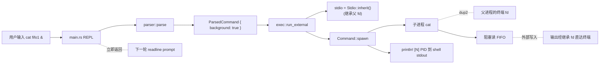

## 产品概述

为现有 Rust shell（codecrafters-shell-rust）完成「Background Job Output」阶段：确保通过 `&` 启动的后台进程的 stdout/stderr 仍连接到 shell 所在终端，使后台进程产生的输出可以与前台 prompt/输出交错地直接显示在用户终端上。

## 核心功能

- 后台外部命令（无重定向时）spawn 时继承 shell 进程的 stdout/stderr fd（`Stdio::inherit()`），子进程写入直达终端
- 用户在 shell 中执行 `cat /path/to/fifo &` 后立即获得 prompt，FIFO 收到数据时输出在终端可见
- 紧随的前台命令（如 `cat /path/to/fifo2`）输出同样直达终端，前后台输出不互相吞掉
- 重定向（`> file` / `2> file`）仍优先生效，未带重定向时一律 inherit
- 现有 123/123 单元测试零回归

## 验收标准（来自题面 tester）

- `cat /path/to/fifo1 &` 启动后立即返回 prompt，对应 FIFO 写入的内容出现在 shell 终端
- 接着运行 `cat /path/to/fifo2`（前台），对应 FIFO 写入的内容出现在 shell 终端
- 前后台进程与 shell 共享同一对 stdout/stderr

## 关键判断：主逻辑零改动

经探索确认 `src/exec.rs` 中 `run_external` 当前实现已满足本阶段题面要求：

- L71-80：无 `stdout_redirect` 时 `stdio = Stdio::inherit()`
- L81-90：无 `stderr_redirect` 时 `err_stdio = Stdio::inherit()`
- L104-126：后台分支 `command.spawn()` 启动子进程后立即返回，子进程 fork 时复制父进程已配置好的 stdout/stderr fd（即终端 fd），即便后续 shell 进入下一轮 readline，子进程仍持有原 fd 写终端
- `Child` 被 drop 不触发 wait/kill，子进程作为孤儿被 init 接管，但 fd 继承不依赖父进程存活——POSIX 语义保证

故本阶段属于「行为已正确，需文档锁定 + 集成测试覆盖」类工作。

## 技术栈

- 语言/版本：Rust edition 2024（与 Cargo.toml 一致）
- 标准库：`std::process::{Command, Stdio, Child}`、`std::os::unix::process::CommandExt`、`std::os::unix::fs::*`（用于 mkfifo 通过 `nix` 或直接 `libc`——但项目无 nix/libc 依赖，集成测试需用其他方式）
- 集成测试 FIFO 创建：调用系统 `mkfifo` 命令（`std::process::Command::new("mkfifo")`）避免引入新依赖，保持 Cargo.toml 不变
- 测试 binary 路径：`env!("CARGO_BIN_EXE_codecrafters-shell")`（Cargo 内置环境变量，零依赖、零硬编码路径）

## 实现策略

### 1. 文档锁定（src/exec.rs）

仅在 `run_external` 后台分支与模块头注释补充明确语义说明：

- 强调 `Stdio::inherit()` 在 `Command::spawn` 时通过 `dup2` 把父进程当前 stdout/stderr fd 复制到子进程同号 fd，**fd 复制后独立存活**，与父进程后续是否 wait / Child 是否 drop 无关
- 解释为什么这恰好满足 codecrafters Background Job Output stage：FIFO 一端阻塞读，子进程在 shell prompt 已返回后才被唤醒并写入，此时仍能直达终端
- 与 rustyline raw mode 的边界：raw mode 改变的是 shell 自身**读** stdin 的回显/行缓冲行为，不影响其他进程 **写** 终端 fd 的可见性

### 2. 集成测试（新增 tests/background_stdio.rs）

复刻题面 tester 场景的端到端测试：

**测试编排**：

1. `mkfifo` 两个 FIFO 到 `std::env::temp_dir()` 下唯一目录（用进程 PID + 时间戳避免冲突）
2. `Command::new(env!("CARGO_BIN_EXE_codecrafters-shell"))` spawn shell 二进制，stdin/stdout 用 `Stdio::piped()` 让测试读写
3. 关键：测试场景下 stdin 是管道而非 tty，rustyline 在非 tty 输入下退化为简单 line-by-line 读取，prompt 仍写 stdout（混在输出中），需在断言时按子串匹配而非按行匹配
4. 向 shell stdin 写：`cat <fifo1> &\n` 然后 `cat <fifo2>\n`（**不**写 exit——前台 cat 会阻塞，需在测试末尾 kill shell）
5. 起两个独立 `Command` 异步向 fifo1 / fifo2 写入测试 payload（用 `sh -c "echo -ne 'Hello FIFO#1\n' > <fifo1>"` 形式，与题面 tester 行为一致）
6. 在线程内带超时（推荐 5s）持续 read shell 的 stdout 管道，累积到字符串
7. 验证累积字符串同时包含两条 payload 子串
8. cleanup：`shell_child.kill()` + 删除 FIFO 文件 + 删除临时目录

**超时与稳定性**：

- 用 `std::thread::spawn` + `mpsc::channel` 实现读取超时（标准库无 read timeout），主线程 `recv_timeout(Duration::from_secs(5))`
- FIFO 写入端必须**晚于** shell 中 `cat ... &` 启动后再写——否则 cat 还没 open FIFO 就被写端关闭会导致丢数据。简单做法：写入前 `thread::sleep(Duration::from_millis(200))`
- 测试用 `#[ignore]` 标记？——不加，让 `cargo test` 默认跑；但用 `cfg(unix)` 防止其他平台编译失败

### 3. 性能与回归

- 主逻辑零改动 = 零性能影响
- 集成测试 spawn 真实二进制 + IO 等待，单次 ~1s，标记为常规 test 不阻塞 dev loop
- 既有 123 条单元测试零接触

## Implementation Notes

- **保持现有 inherit 默认**：不要把 `Stdio::inherit()` 改成 `Stdio::piped()` 或显式 `from_raw_fd`——前者会让子进程写阻塞在父管道，后者引入 unsafe
- **不要 setsid**：题面未要求作业控制（进程组分离/SIGHUP 处理），保持子进程在 shell 进程组内即可
- **不要 wait 后台 Child**：保留现有「立即 drop Child」行为；显式 wait 会阻塞 REPL
- **集成测试用 `env!("CARGO_BIN_EXE_codecrafters-shell")`**：Cargo 编译 integration tests 时自动注入二进制路径，避免硬编码 `target/debug/...`
- **不引入新依赖**：mkfifo 用系统命令，超时用 `mpsc::recv_timeout`，FIFO 路径用 `std::env::temp_dir()` + PID 拼接
- **测试隔离**：每次测试用独立临时目录，cleanup 即使 panic 也尽量执行（用 RAII guard struct 或 `defer`-like 模式）
- **日志策略**：集成测试失败时把累积到的 shell stdout 内容 `eprintln!` 出来便于诊断；不在主逻辑加任何运行时日志（避免污染 shell stdout 影响题面 tester）

## 架构图



## 目录结构

```
codecrafters-shell-rust/
├── src/
│   └── exec.rs                  # [MODIFY] 仅补充模块头注释与 run_external doc：
│                                #   - 在模块级 doc 末尾新增「## Background Job stdio 继承（Stage: Background Job Output）」段落
│                                #   - 在 run_external 函数 doc 的「关键路径注释」处添加一条说明：
│                                #     `Stdio::inherit()` 在 spawn 时通过 dup2 复制父 fd，子进程获得独立 fd，
│                                #     生命周期与 Child 句柄解耦，故后台 cat 读 FIFO 阻塞时 shell prompt 已返回，
│                                #     FIFO 写入到达时 cat 仍能直写终端。
│                                #   - 无任何可执行代码改动，零编译影响。
└── tests/
    └── background_stdio.rs      # [NEW] 集成测试，端到端复刻题面 tester 场景：
                                  #   - 用 mkfifo 系统命令在临时目录创建 fifo1 / fifo2
                                  #   - spawn shell 二进制（env!("CARGO_BIN_EXE_codecrafters-shell")），
                                  #     stdin/stdout piped
                                  #   - 写入 `cat <fifo1> &\n` 与 `cat <fifo2>\n` 两行
                                  #   - sleep 200ms 等 shell 启动 cat 子进程并 open FIFO
                                  #   - 通过 sh -c 异步向两个 FIFO 写入 payload
                                  #   - 用单独线程 + mpsc::channel 读 shell stdout，主线程 recv_timeout(5s)
                                  #   - 验证累积输出同时包含两条 payload 子串
                                  #   - 用 RAII guard 在 Drop 中 kill shell + 删 FIFO + 删临时目录
                                  #   - 用 #[cfg(unix)] 限定，避免 Windows 编译失败
```

## 关键代码骨架（仅说明意图，非最终代码）

```rust
// tests/background_stdio.rs
#![cfg(unix)]

// guard：保证 panic 时也清理 shell 子进程与 FIFO
struct Cleanup { shell: std::process::Child, dir: std::path::PathBuf }
impl Drop for Cleanup {
    fn drop(&mut self) {
        let _ = self.shell.kill();
        let _ = self.shell.wait();
        let _ = std::fs::remove_dir_all(&self.dir);
    }
}

#[test]
fn background_cat_output_reaches_terminal() {
    // 1. 临时目录 + mkfifo fifo1 / fifo2
    // 2. spawn shell（CARGO_BIN_EXE_codecrafters-shell），stdin/stdout = piped
    // 3. 写入两行命令到 shell stdin
    // 4. 后台线程读 shell stdout 到 String，通过 mpsc 发回主线程
    // 5. sleep 200ms，再 sh -c "echo -ne 'Hello FIFO#1\n' > <fifo1>"
    //                       sh -c "echo -ne 'Hello FIFO#2\n' > <fifo2>"
    // 6. recv_timeout(5s) 拿到累积输出，assert 含两条 payload
    // 7. Cleanup::drop 自动清理
}
```