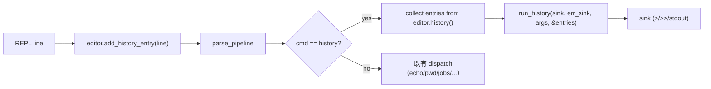

## 用户需求

为 Rust 实现的 shell 新增 `history` 内建命令支持。

## 产品概述

当前 codecrafters 阶段要求 `type history` 输出 `history is a shell builtin`。在此基础上一并实现 `history` 命令本体：列出本次 shell 会话已执行过的命令历史，按编号顺序输出。

## 核心功能

- `type history` 输出 `history is a shell builtin`，与既有 `type echo` 等行为一致
- `history` 命令打印会话内所有已执行命令，格式     `<编号右对齐宽4>  <命令原文>`（编号从 1 起递增）
- `history` 命令自身也进入历史，确保 `$ history` 的最后一行就是 `history`
- 历史数据源：复用 `rustyline::Editor` 内部 history（REPL 每读一条非空命令即 `add_history_entry`）
- 支持 `>` / `>>` 输出重定向（沿用既有 `sink` 链路），可被 `2>` 捕获错误（沿用 `err_sink`）
- TAB 补全自动覆盖 `history` 命令名（沿用既有 `BUILTINS` 单一事实来源机制）

## 技术栈

- Rust 2024 edition，沿用既有依赖（`rustyline = "14"`、`anyhow`、`thiserror`、`bytes`）
- 不新增任何 Cargo 依赖

## 实现策略

**核心思路**：把 `history` 注册进 `BUILTINS` 单一事实来源即可让 `type history` 和 TAB 补全自动工作；在 main.rs REPL 循环中显式调用 `editor.add_history_entry(line)`（rustyline 14 默认不自动添加），并在 dispatch 分支中把 `editor.history()` 的快照传给新增的 `run_history` 渲染器。

**关键技术决策**：

1. **历史数据源选 rustyline editor 内部 history**：避免维护并行的历史 Vec，复用 rustyline 已有的 `History` trait 抽象（`len()` + `get(idx, SearchDirection::Forward)`），未来扩展 `history -r` / `history -w` 时 rustyline 已提供 `load`/`save` 文件持久化能力。
2. **add_history_entry 调用时机放在 dispatch 之前**：题面示例 `history` 自身需出现在输出末行，故必须在 match cmd 之前加入历史；空行已在 `if line.is_empty() { continue }` 处早返回，不会污染历史。
3. **run_history 签名取 `entries: &[String]` 而非 `&dyn History`**：与既有 `run_jobs(_, _, _, jobs: &mut Vec<Job>)` 风格对齐；解耦 rustyline 类型依赖，便于单测构造任意 entries 切片断言格式契约。entries 在 main.rs 调用点用一次性循环从 `editor.history()` 收集为 `Vec<String>`，成本与 history 长度线性相关（典型 < 千条，O(n) 可忽略）。
4. **输出格式 `{:>4}  {entry}`**：复刻 bash 真实 `history` 输出（编号右对齐到 4 字符宽 + 2 空格分隔），与题面 example 完全吻合。
5. **本阶段不实现 `history N` / `history -r` / `history -w` 等 flag**：参数静默忽略（YAGNI，与既有 `run_complete` 「其他形态静默 Ok」风格一致），后续阶段按需扩展。
6. **pipeline 中段 history 暂不接入**：本阶段题面无 pipeline 要求，沿用 `exec.rs` 现有 builtin 白名单，避免 blast radius。

## 实现要点（Implementation Notes）

- **复用既有 sink 链路**：`run_history(sink, err_sink, args, entries)` 直接 `writeln!(sink, ...)`，自动获得 `>` / `>>` / `1>>` 重定向支持，与 `run_jobs` / `run_echo` 一致。
- **避免重复扫描**：rustyline `History::get(idx, dir)` 返回 `Result<Option<SearchResult>>`，循环 `for i in 0..h.len()` 走一遍即可；不引入 HashMap/缓存（history 长度可控）。
- **rustyline borrow 不冲突**：`editor.history()` 返 `&dyn History`，先 `Vec<String>` 收集再调 `run_history`（释放借用），避免后续与 `editor.add_history_entry` 的 borrow checker 冲突。
- **日志/错误**：错误信道沿用既有约定——sink 写失败兜底 `eprintln!`；history 命令自身无错误路径（空 history 时输出 0 行），与 `run_jobs` 空表行为一致。
- **向后兼容**：除新增 `BUILTINS` 条目和 `match cmd` 分支外，不修改任何现有 dispatch / pipeline / completion / job 逻辑，零回归风险。

## 架构设计

沿用既有「main.rs 分发 + builtins.rs 实现 + sink/err_sink 双写」分层。新增 `run_history` 与 `run_jobs` / `run_echo` / `run_pwd` 同层，无新增模块。



## 目录结构

```
codecrafters-shell-rust/
├── src/
│   ├── builtins.rs    # [MODIFY] BUILTINS 数组追加 "history"；新增 pub fn run_history(sink, err_sink, args, entries: &[String]) -> io::Result<()>，按 `{:>4}  {entry}\n` 格式渲染；在 #[cfg(test)] mod tests 内追加 4 个单测：空 history 零字节、单条命令编号 1、多条命令编号递增、宽度右对齐验证（≥10 条触发 2 位数编号检查列对齐）
│   └── main.rs        # [MODIFY] use builtins::{... run_history}；REPL 主循环在 parser 解析成功后、dispatch 之前调 editor.add_history_entry(line)（忽略 Result）；match cmd 加 "history" 分支：用 for i in 0..editor.history().len() + history().get(i, SearchDirection::Forward) 收集 Vec<String>，再调 run_history(&mut *sink, &mut *err_sink, args, &entries)，写失败兜底 eprintln!
└── tests/             # 无新增集成测试（history 数据源依赖 rustyline editor 实例，集成测试成本高于收益；格式契约通过 builtins.rs 内单测覆盖）
```

## 关键代码接口

```rust
// src/builtins.rs 新增
pub fn run_history(
    sink: &mut dyn Write,
    err_sink: &mut dyn Write,
    args: &[String],
    entries: &[String],
) -> io::Result<()>;
```