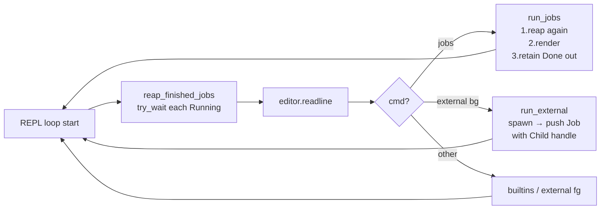

## 用户需求

扩展 `jobs` 内建以回收（reap）已完成的后台作业。当后台进程退出后，下一次执行 `jobs` 时应将其以 `Done` 状态显示一次，并从作业表中移除，使后续 `jobs` 不再列出该项。

## 核心功能

- **状态推进**：每次 REPL prompt 之前，对作业表中所有 Running 项调用 `Child::try_wait()` 进行非阻塞探测；已退出者标记为 `Done`，仍存活者保持 `Running`。
- **`jobs` 渲染契约**：
- Running 行：`[N]+  Running                 <cmd> &`（24 宽 status，命令带尾  `&`）
- Done 行：`[N]+  Done                    <cmd>`（24 宽 status，命令不带尾 `&`）
- **一次性移除**：`run_jobs` 在打印 Done 行之后，立即将该项从作业表中删除，下一次 `jobs` 不再显示。
- **不处理异常**：仅检测正常退出；信号终止、停止状态不在本阶段范围内。
- **作用范围**：本阶段仅保证单个后台作业；多作业前向兼容已在上一阶段的 `+/-/空格` mark 计算中预留。

## 技术栈

- Rust 2021，`std::process::{Child, Command}`，`std::cell::RefCell`，`std::rc::Rc`
- 不引入新外部依赖

## 实现策略

### 核心思路

将 `Child` 句柄从 spawn 时的「`drop` 即弃」改为「move 进 `Job` 表持有」，使主循环可在任意时刻通过 `Child::try_wait()` 进行 WNOHANG 风格的非阻塞探测。状态推进与显示/移除职责分离：

- **状态推进**（Running→Done）：在主循环 readline 之前与 `run_jobs` 入口处各调用一次 `reap_finished_jobs`，前者更接近 bash 行为，后者作为兜底确保即便首次 prompt 前未触发也能在 `jobs` 时即时反映。
- **显示**：`run_jobs` 遍历，按 status 拼接 `&`/不拼接，统一用 `{:<24}` 格式化 status 字段。
- **移除**：遍历完后单次 `Vec::retain(|j| j.status != Done)` 一次性删除所有 Done。`Child` 已被 `try_wait` 成功收尾（返回 `Ok(Some(_))`），随 Job 从 Vec 中 drop 时无僵尸残留。

### 关键技术决策

1. **保留 Child 句柄**：`Job` 持有 `child: std::process::Child`，零 unsafe、无新依赖、跨平台，避免裸 `libc::waitpid` 路径。代价：`Job` 失去 `Clone` 能力（Child 不可 Clone）。
2. **去掉 `#[derive(Debug, Clone)]`**：`Child` 既不 `Clone` 也不 `Debug`。本阶段无 Debug 输出与克隆依赖，直接去除两个 derive 最简单，无需手写 impl。
3. **存储不含尾 `&`**：维持上一阶段 `parsed.argv.join(" ")` 风格，渲染时按 status 动态拼接。`Done` 行不拼，与 bash 行为一致。
4. **prompt 前 + run_jobs 入口双扫描**：用户已确认 prompt 前扫描；`run_jobs` 内再扫一次作为防御（极低开销，单次 try_wait 仅一次系统调用），保证「`cat fifo &` 后立即写 fifo 然后立即 `jobs`」这种 prompt 间隔被压缩的边界场景仍能正确显示 Done。
5. **`Err(_)` 视为 Done**：try_wait 在子进程已被收掉后返回 `Err(ECHILD)`；防御性地把任何 Err 都标记为 Done，避免僵尸或卡死表项。

### 性能与可靠性

- 单作业场景下 reap 路径开销 = 1 次 `waitpid(WNOHANG)`，纳秒级；多作业线性遍历，本阶段无 N 的上界压力。
- borrow 作用域：`reap_finished_jobs(&mut *jobs_table.borrow_mut())` 单语句完成，绝不跨越 `editor.readline()`，避免 RefCell 双借 panic。
- `run_jobs` 内 `let mut view = jobs_table.borrow_mut();` 借用作用域随 match arm 结束释放，不与后续 dispatch 冲突。

## 实现注意事项

- **mark 计算**：保持上一阶段「最近 `+`、次新 `-`、更早空格」逻辑；retain 后 `last_idx` 重新计算与显示一致——但本阶段在「先渲染、再 retain」的顺序下，渲染时用的是删除前的 `last_idx`，与 bash 单作业场景输出严格一致。
- **格式精度**：`Done` 串长度 4，`{:<24}` 自动填充 20 空格使总宽 = 24，紧接 `cmd`，无尾 `&`、无尾空格（除了 status 字段内部的填充空格）。
- **24 宽校验**：`Running ` 7 字符 + 17 空格 = 24；`Done` 4 字符 + 20 空格 = 24。两条单测分别精确比对字节序列。
- **测试 fixture**：`Job` 失去 Clone 后，单测必须用真实子进程构造：
- 长存 Running：`Command::new("sleep").arg("30").spawn()`，用例末尾 `.kill()` 兜底
- 已退出 Done：`Command::new("true").spawn()` 后 `wait()` 让进程退出，再走 `reap_finished_jobs` 验证状态推进
- **集成测试 FIFO 时序**：写空字节后需短 sleep（约 200ms）让 cat 退出 + 让 prompt 前 reap 推进；不要依赖外部信号同步。
- **零回归保证**：上一阶段 `tests/jobs_builtin.rs`（`sleep 10 &` → `jobs`）本阶段输出变为 `sleep 10 &`，原断言子串 `sleep 10` 仍命中，**保留不动**。

## 架构示意



## 目录结构

```
codecrafters-shell-rust/
├── src/
│   ├── builtins.rs   # [MODIFY] JobStatus 追加 Done；Job 追加 child 字段并去除 Debug/Clone derive；新增 reap_finished_jobs；run_jobs 签名改 &mut Vec<Job>，内部 reap+渲染+retain；重构 mod tests 的 4 条 run_jobs 用例为基于真实子进程
│   ├── exec.rs       # [MODIFY] run_external 后台分支：构造 Job 时 move 进 child 字段；删除 drop(child);
│   └── main.rs       # [MODIFY] import 追加 reap_finished_jobs；主循环 readline 前调用 reap_finished_jobs(&mut *jobs_table.borrow_mut())；"jobs" 分支改 borrow_mut() 并传 &mut view
└── tests/
    └── jobs_builtin.rs  # [MODIFY] 新增完整三步序列集成测试 jobs_done_then_removed（FIFO + cat & → jobs(Running) → 写 FIFO → jobs(Done) → jobs(empty)）；保留上一阶段 sleep 10 & 用例
```