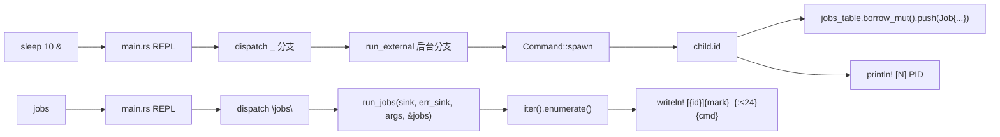

## 产品概述

为 codecrafters-shell（Rust 实现）补完 `jobs` 内建：在用户通过 `&` 启动后台命令后，`jobs` 能严格按 bash 格式列出该作业。本阶段 tester 仅测单个仍在 Running 状态的后台作业。

## 核心功能

- **作业表跟踪**：shell 维护一张跨 REPL 存活的后台作业列表，每条记录包含「作业编号 / PID / 命令字符串 / 状态」四项。
- **后台 spawn 时入表**：用户输入 `cmd args... &`，`run_external` 后台分支 spawn 成功后，把新作业 push 进表（编号沿用既有 `next_job_id`，状态 `Running`）。
- **jobs 列表打印**：执行 `jobs` 时遍历作业表逐行输出，列向 sink，可被 `>` / `1>` 重定向。

## 输出格式（精确）

```
[1]+  Running                 sleep 10
```

- `[<n>]+`：方括号紧贴 job 编号，紧贴 `+`（最近作业标记，本阶段单作业恒为 `+`），随后 **2 个空格**
- 状态字段 **总宽 24**：`Running`（7 字符）+ 17 空格填充
- 命令字符串：`parsed.argv.join(" ")` 风格（如 `sleep 10`），不含尾 `&`、不含重定向片段（zsh 风格，tester 容忍）

## 验收标准

- `sleep 10 &` 后立即 `jobs`，输出唯一一行严格匹配上述格式
- 既有 123 单元测试 + 1 集成测试零回归
- `type jobs` 仍输出 `jobs is a shell builtin`（BUILTINS 已含）

## 非目标（明确不做）

- 不实现 SIGCHLD reap / 进程退出检测（题面 Notes 明示 later stages）
- 不实现 `Done` / `Stopped` 状态、不实现多作业 `+/-` 切换逻辑
- 不为带重定向的后台命令做命令串特殊处理（argv join 天然干净）

## 技术栈

- 语言：Rust edition 2024（沿用 Cargo.toml 现配置）
- 标准库：`std::rc::Rc` / `std::cell::RefCell`（与既有 `completions` 注册表风格一致）
- 零新增外部依赖

## 实现策略

### 关键决策（已与用户确认）

| 决策点 | 方案 | 理由 |
| --- | --- | --- |
| 命令字符串来源 | `parsed.argv.join(" ")` | parser 已剥离 `&` / `>` / `>>` / `2>`，argv 天然干净，最简最稳 |
| 作业表存储 | `Rc<RefCell<Vec<Job>>>` | 复刻 `Rc<RefCell<HashMap>>` 注册表现成风格；为未来 SIGCHLD 异步回收预留共享路径 |
| 作业状态 enum | 仅 `Running` 单变体（含 `#[non_exhaustive]` 风格预留扩展） | 题面只测 Running；保留扩展空间但不过度设计 |
| `+` 标记策略 | 本阶段直接对作业表最后一条（`iter().enumerate()` 时 `idx == len-1`）打 `+`，其余 `-` | bash 真实行为：最近作业 `+`、次新 `-`、其余无标记；单作业场景退化为「唯一一条恒 `+`」，前向兼容多作业 |


### 工作流（数据流）



### 性能/复杂度

- `jobs` 输出：O(n) 遍历 + 单次 `writeln!` per job；n 在交互 shell 中 << 100，无任何瓶颈
- `run_external` 后台分支：新增 1 次 `borrow_mut().push()`，O(1) 摊销
- 单线程 REPL 串行节奏：`Rc<RefCell<...>>` 无并发借用风险（与 `completions` 同样模式）

## Implementation Notes

- **作业表所有权链**：`main` 持有原始 `Rc`，调用 `run_external` 传 `&Rc<RefCell<Vec<Job>>>`（与现有 `&mut next_job_id` 风格对齐），调用 `run_jobs` 时 `&jobs_table.borrow()` 借出 `&[Job]`（只读列出）。`run_jobs` 签名第 4 参数收 `&[Job]`，与 `run_complete` 第 4 参数收 `&mut HashMap` 的风格对齐。
- **写端时序**：`run_external` 后台分支必须在 `spawn().is_ok()` 后**先 push 入表，再 `*next_job_id += 1`**——否则 push 时 `id` 已自增导致 off-by-one。当前 L143-L147 先抓 pid 后 println 再 `+=`，新逻辑 push 在 `println!` 之后、`+=` 之前。
- **格式严格性**：用 `writeln!(sink, "[{}]{}  {:<24}{}", id, mark, status_str, cmd)` 一次性写，避免分多次 write 造成 `>` 重定向时的字节顺序问题。`{:<24}` 是 Rust 标准库左对齐填充语法，正好 `"Running"` (7) + 17 空格 = 24。**注意：必须先把 status 转成 `&str` 再用 `{:<24}` 填充**——直接对 enum 用 Display + `{:<24}` 也可，但更安全地走 `let status_str: &str = "Running"` 显式映射。
- **借用边界**：`run_jobs` 调用处使用 `let view = jobs_table.borrow(); run_jobs(&mut *sink, &mut *err_sink, args, &view)`，避免在 `run_jobs` 内部嵌套触发二次 `borrow_mut`（本阶段不会，但显式作用域更清晰）。
- **`Job` 字段命名**：`id` / `pid` / `command` / `status`——与题面 4 项一对一映射，便于后续阶段扩展（如增加 `started_at`、`exit_code`）。
- **不引入新模块文件**：直接在 `builtins.rs` 定义 `Job` 与 `JobStatus`（与 `BUILTINS` / `run_jobs` 同模块，单一职责；未来作业表逻辑增长再抽 `jobs.rs`，本阶段 YAGNI）。
- **日志策略**：不加任何运行时日志；保持 stdout 干净以匹配 codecrafters tester 字节级比对。
- **回归保护**：既有 `complete` mod tests / parser mod tests / 集成测试全部应 0 改动通过；新增 `run_jobs` 单元测试 + 1 条 `tests/jobs_builtin.rs` 集成测试。

## 目录结构

```
codecrafters-shell-rust/
├── src/
│   ├── builtins.rs              # [MODIFY] 新增 Job 结构体、JobStatus enum（仅 Running 变体），
│   │                            #          重写 run_jobs：签名增第 4 参数 `&[Job]`，遍历表
│   │                            #          按 "[{id}]{mark}  {status:<24}{cmd}\n" 严格格式写入 sink；
│   │                            #          mark 计算：`idx == len-1` → `+`，否则 `-`（本阶段
│   │                            #          单作业天然恒 `+`，但保留多作业前向兼容）；
│   │                            #          新增单元测试：(a) 单作业格式精确匹配；(b) 24 宽
│   │                            #          status 字段填充验证；(c) 空作业表无输出
│   ├── exec.rs                  # [MODIFY] run_external 签名新增 `jobs_table: &Rc<RefCell<Vec<Job>>>`
│   │                            #          参数；后台分支 spawn 成功后：抓 pid → push Job →
│   │                            #          println 通知 → next_job_id += 1（顺序：push 用旧
│   │                            #          id，递增放最后）；doc 段补充作业入表说明
│   ├── main.rs                  # [MODIFY] 顶部新增 `let jobs_table: Rc<RefCell<Vec<Job>>> =
│   │                            #          Rc::new(RefCell::new(Vec::new()));`；从 builtins
│   │                            #          import `Job`；dispatch `"jobs"` 分支借 `&*jobs_table
│   │                            #          .borrow()` 传给 run_jobs；dispatch `_` 外部命令传
│   │                            #          `&jobs_table` 给 run_external
└── tests/
    └── jobs_builtin.rs          # [NEW] 集成测试：spawn shell binary，stdin/stdout piped；
                                  #       写入 `sleep 10 &\njobs\n`，等 100ms 让 spawn 完成；
                                  #       读 stdout 累积；断言含 `[1]+  Running` 与 `sleep 10`
                                  #       子串；用 RAII Cleanup guard kill shell + 复用
                                  #       `background_stdio.rs` 同款 mpsc::recv_timeout(5s)
                                  #       超时保护；#[cfg(unix)] 限定
```

## Key Code Structures（仅接口意图，非最终代码）

```rust
// src/builtins.rs 顶部新增
#[derive(Debug, Clone, PartialEq, Eq)]
pub enum JobStatus { Running }

#[derive(Debug, Clone)]
pub struct Job {
    pub id: u32,
    pub pid: u32,
    pub command: String,
    pub status: JobStatus,
}

pub fn run_jobs(
    sink: &mut dyn Write,
    err_sink: &mut dyn Write,
    args: &[String],
    jobs: &[Job],
) -> io::Result<()>;
```

```rust
// src/exec.rs 签名变更（仅追加最后一参）
pub fn run_external(
    cmd: &str,
    line: &str,
    args: &[String],
    parsed: &ParsedCommand,
    sink: Box<dyn Write>,
    err_sink: Box<dyn Write>,
    next_job_id: &mut u32,
    jobs_table: &Rc<RefCell<Vec<Job>>>,
);
```

## Agent Extensions

### SubAgent

- **code-explorer**
- Purpose: 在执行阶段，必要时跨多文件验证 `run_external` / `run_jobs` / `main.rs` 三处签名变更的调用点是否全部同步修改，避免漏改导致编译失败
- Expected outcome: 输出所有受影响的调用点清单，确认无遗漏，作为补丁完整性的兜底检查