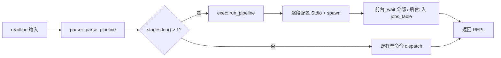

## 产品概述

为现有 Rust shell 增加 **pipeline（`|`）支持**：用户输入 `cmd1 | cmd2 | ... | cmdN` 时，shell 将各段命令以管道串联——上一段的标准输出连接到下一段的标准输入，所有段并行运行，shell 等待全部结束后回到 prompt。题面要求两段外部命令的场景必须可用，本实现进一步前瞻支持 N 段，且任一段可以是内建命令。

## 核心功能

- **N 段任意长 pipeline**：词法/语法层识别引号外 `|` 为独立操作符 token，引号内字面量保留；空段（如 `| ls`、`ls |`、`ls | | cat`）报语法错误。
- **每段独立保留重定向语义**：单段 `>` / `>>` / `2>` / `2>>` 仍生效，且**优先级高于 pipe**（如 `cmd1 > out | cmd2` 中 cmd1 走文件，cmd2 stdin 收到 EOF），与 bash 一致。
- **末尾 `&` 只作用于整条 pipeline**：触发后台执行，作业表中以最后一段 PID 标识。
- **任一段可以是 builtin**：echo / pwd / type / cd / jobs / complete / exit 在 pipeline 中由父进程同步执行，输出写到 pipe 写端、输入忽略上游（现有 builtin 均不读 stdin，语义与 bash 等价）。
- **POSIX SIGPIPE 自然回收**：`tail -f file | head -n 5` 中 head 满 5 行退出 → pipe 读端关闭 → tail 下次 write 收 SIGPIPE 被默认 handler 终止；shell 仅 `wait` 全部子进程。
- **前台 pipeline 等待全部结束**：返回整体退出码（取最后一段 ExitStatus，本阶段记录但暂不暴露 `$?`，为后续阶段铺路）。
- **后台 pipeline 进入 jobs 表**：`Job.children: Vec<Child>` 跟踪所有子进程，全部 Done 时该 Job 才视为 Done，自动 reap 与 `jobs` 渲染语义与现有单进程后台一致。
- **REPL 鲁棒性**：pipeline 解析错误 / 子进程 spawn 失败 / pipe 创建失败均打印到 stderr 并跳过本轮，不中断 REPL。

## 题面验收场景

- `cat /tmp/foo/file | wc` → 输出三列计数。
- `tail -f /tmp/foo/file-1 | head -n 5` → 收满 5 行后整条 pipeline 自动结束，shell 回到 prompt。

## Tech Stack

- 语言：Rust 2024 edition（沿用现有 `Cargo.toml`，rust-1.95）
- 标准库 `std::process::{Command, Stdio, ChildStdin, ChildStdout}` + `std::os::unix::process::CommandExt::arg0` 完成 pipe 串联，**不引入新 crate**。
- 复用既有依赖：`anyhow` / `thiserror` / `rustyline` / `bytes`。
- 测试：`cargo test`，集成测试沿用 `tests/jobs_builtin.rs` 既有 `Cleanup` + `drain_until` 工具风格。

## 实现策略

### 核心方法：std-only 多段 pipe 串联

采用 rust 标准库 `Command::stdout(Stdio::piped())` 的**链式 take-and-pass** 模式：

1. 第 i 段（0..N）配置 stdin：i == 0 时 `Stdio::inherit()`，否则 `Stdio::from(prev_child.stdout.take().unwrap())`。
2. 配置 stdout：i == N-1 时 `Stdio::inherit()`（或单段重定向覆盖），否则 `Stdio::piped()`。
3. 立刻 `spawn` 得到 `Child`，作为下一轮的 `prev_child`。
4. 每段段内 `>` / `2>` 重定向**优先级高于 pipe**：若该段配置了 stdout_redirect 则 stdout 走文件而非 piped（此时下游 stdin 收 EOF，与 bash 一致）。
5. 全部 spawn 完成后，**所有中间 ChildStdout 句柄已 move 进下一段 Command**，父进程不残留 pipe 写端 fd，下游 EOF 可正常触发。

**为何不用 `nix::fork`**：保持零新依赖；rust std 的 `Command::spawn` 已封装 `fork+dup2+exec`，pipe fd 继承语义自动正确。代价是 builtin 无法 `fork` 后在子进程直接执行——通过「builtin in pipeline 由父进程同步执行」绕过（见下）。

### Builtin in pipeline 设计

现有所有 builtin 都**不读 stdin**（echo / pwd / type / cd / jobs / complete / exit），故 builtin 出现在 pipeline 任意段时：

- 父进程内同步调用对应 runner；
- sink 绑定到本段的 stdout pipe 写端（用 `os_pipe`?——不，用 `std::process::Command` 拿不到裸 pipe fd，故 builtin 段需用 `nix::pipe`）……**修正方案**：用 std 的 `Command` 是无法独立创建裸 pipe 的——这里改用 **builtin 段在父进程内执行时，把输出写入临时 `Vec<u8>` 缓冲，然后通过下一段 Command 的 `Stdio::piped()` stdin 全量写入**的间接方案。

具体子方案选择：

- **首段为 builtin**：父进程同步执行 builtin 收集到 `Vec<u8>`；下一段 Command 配置 `Stdio::piped()` stdin；spawn 后用 `child.stdin.take().unwrap().write_all(&buf)` 一次写入后 drop。
- **中段 / 末段为 builtin**：因 builtin 不消费 stdin，上游输出对其无影响——把上游写到一个 throwaway pipe（消费 EOF）即可，或直接让上游 stdout 重定向到 `/dev/null` 等价路径。简化方案：**该段在父进程同步执行 builtin，输出写到下一段 stdin 缓冲（或终端，若为末段）**；同时把上游 Child 的 stdout 用 `Stdio::null()` 丢弃。
- **末段为 builtin**：父进程同步执行，sink = io::stdout()（受 pipeline 整体 stdout 重定向支配）；上游 stdout 重定向到 `Stdio::null()`（builtin 不读 stdin）。

**简化取舍**：题面 tester 不测 builtin in pipeline，但用户要求前瞻；以上方案使用纯 std + 缓冲，无需 fork、无需新 crate，代码量可控；如未来需要支持「读 stdin 的 builtin」（如未来 `read` 命令），可升级为 nix::fork 方案，blast radius 局限在 `exec::run_pipeline`。

### Job 结构升级

`Job.child: Child` → `Job.children: Vec<Child>`（即使单进程命令也是 `vec![child]`），统一 reap 路径：

- `advance_job_status`：遍历 `children`，全部 `try_wait` 返回 `Ok(Some(_))` 或 `Err(_)` 才置 Done；任一仍 Running 保持 Running。
- `allocate_job_id`：算法不变。
- `Job.pid`：取最后一段的 PID（与 bash 一致——`$!` 是 pipeline 最后一段）。

### Parser 升级

- `tokenize`：在 `>` 与 `&` 之间新增 `|` 分支，**仅识别单字符** `|`（`||` 逻辑或本阶段不实现，作为已知简化；可在分支内 peek 下一字符判定，若为 `|` 则保留 `||` 暂作字面量或报错，本阶段选择「`||` 切成两个独立 `|` token，触发 `EmptyPipelineSegment` 错误」，与 bash 在缺少 `||` 实现时的最近似行为）。引号内 `|` 字面量保留。
- 新增结构 `Pipeline { stages: Vec<ParsedCommand>, background: bool }`：
- `stages` 为按 `|` 切分的每段 ParsedCommand（每段保留自己的 `*_redirect` / `*_append`）；
- `background` 从单 ParsedCommand 上移到 Pipeline 层（末尾 `&` 解析时机：在最外层 token 序列切分 `|` 之前先 pop 末尾 `&`）。
- 单段命令（无 `|`）：返回 `Pipeline { stages: vec![single], background }`，REPL 上层统一处理 `len()==1` 走快速路径。
- 新增 `ParseError::EmptyPipelineSegment`（空 stage：开头 `|`、末尾 `|`、连续 `||`）。
- `ParsedCommand.background` 字段保留但 deprecated（始终为 false），由 Pipeline.background 替代——避免破坏既有内部测试。

### REPL Dispatch 升级

`main.rs` 解析后判断 `pipeline.stages.len()`：

- == 1：走既有 builtin / external 单命令路径，传 `pipeline.stages[0]`；
- > 1：走 `exec::run_pipeline(&pipeline, &jobs_table)`，sink / err_sink 在 pipeline 内部按段独立物化。

### 性能 & 可靠性

- pipe 创建：N 段产生 N-1 个 pipe，每个 spawn 一次 fork+exec；典型 N ≤ 5，整体开销远小于子进程 startup。
- **关键正确性约束**：所有中间 ChildStdout 必须 move 进下一段 Command，**禁止**在 take 后保留任何引用，否则父进程仍持 pipe 写端，下游永远收不到 EOF（导致 `tail -f | head` 永远不退出）。代码层通过「单变量 prev_stdout 串联」+ 全 spawn 完成后立即清空保证。
- **SIGPIPE**：rust std 子进程默认不 mask SIGPIPE（仅父进程 main.rs 启动时如果有 `signal(SIGPIPE, SIG_IGN)` 才会继承——本项目无此设置），故 POSIX 默认终止行为正常生效。
- **等待顺序**：依次 `child.wait()` 全部 Children；即便上游因 SIGPIPE 死亡，wait 立即返回。

### 避免技术债

- 沿用现有原子函数风格：新增 `run_pipeline` 与 `spawn_pipeline_stage` 等小函数，保持单一职责。
- 复用 `find_in_path` / `open_file_for_redirect` / `allocate_job_id` / `advance_job_status`，零重复实现。
- 不引入 `nix` / `os_pipe` 等新 crate，保持 Cargo.toml 不变。

## Implementation Notes

- **performance**：pipeline 热路径在 spawn 与 wait，O(N) 系统调用；中段 builtin 缓冲采用 `Vec<u8>`，单段输出量典型 < 1MB，可接受。
- **logging**：pipeline 路径无新日志；spawn 失败按既有 `command not found` 格式写 err_sink，与 `run_external` 一致。
- **blast radius**：
- `Job` 字段重命名 `child → children` 是破坏性改动，需同步更新 `exec.rs` 后台分支 push 路径与 `builtins.rs` 内 reap 路径（`advance_job_status` / 其他读 `child` 处）。
- `ParsedCommand.background` 字段保留但置位逻辑下移到 Pipeline.background；REPL 内单段路径仍可读 `pipeline.background` 决定走前台 / 后台。
- 既有集成测试 `tests/background_stdio.rs` / `tests/jobs_builtin.rs` 行为不变（单进程后台路径在 `children = vec![child]` 下完全等价）；既有 parser 单测可能因 `|` 词法切分新增需复核（既有用例不含 `|`，应零冲突，但需 [subagent:code-explorer] 全仓 grep 验证）。
- **backward compatibility**：单段命令路径完全不变；多段路径是新增能力。

## Architecture Design



## Directory Structure

```
codecrafters-shell-rust/
├── src/
│   ├── parser/
│   │   ├── tokenize.rs   # [MODIFY] Normal 态 match 中在 `>` 与 `&` 之间新增 `|` 分支：
│   │   │                 #   - 引号外作为独立 token 切出（无论前是否有空白），与 `>` / `&` 切分规则对称；
│   │   │                 #   - peek 下一字符若仍是 `|`（即 `||`）：本阶段简化为切成两个独立 `"|"` token，
│   │   │                 #     由上层 parse 通过 EmptyPipelineSegment 报错；
│   │   │                 #   - 引号内（InSingleQuote / InDoubleQuote）的 `|` 仍按字面量保留；
│   │   │                 #   - `\|` 走 Normal 态 `\\` 分支按字面量保留。
│   │   ├── parse.rs      # [MODIFY] 新增 pub struct Pipeline { stages: Vec<ParsedCommand>, background: bool }；
│   │   │                 # 新增 pub fn parse_pipeline(input: &str) -> Result<Pipeline, ParseError>：
│   │   │                 #   1. tokenize；
│   │   │                 #   2. pop 末尾 `"&"` 得到 background 标志（上移自单 ParsedCommand）；
│   │   │                 #   3. 按 `"|"` token 切分 token 序列为多个子序列；
│   │   │                 #   4. 空子序列（首/末/中间空）→ Err(EmptyPipelineSegment)；
│   │   │                 #   5. 每个子序列复用现有 parse 内部扫描逻辑识别 `>` / `>>` / `2>` / `2>>` 重定向，
│   │   │                 #      组装为 ParsedCommand（background 字段固定 false）；
│   │   │                 # 保留现有 pub fn parse 作 thin wrapper：内部调 parse_pipeline 后断言 stages.len() == 1
│   │   │                 # （否则返回新 ParseError 或合并为单 stage——倾向后者：直接返回 stages[0] 并把 Pipeline.background
│   │   │                 #   回填 ParsedCommand.background 保持既有调用兼容）。
│   │   │                 # 抽取私有 helper fn collect_redirects(tokens: Vec<String>) -> Result<ParsedCommand, ParseError>
│   │   │                 # 供两条路径共享，避免重定向扫描逻辑重复。
│   │   ├── mod.rs        # [MODIFY] ParseError 新增 EmptyPipelineSegment 变体 + Display 文案
│   │   │                 # "syntax error: empty pipeline segment"；
│   │   │                 # pub use 增加 parse_pipeline、Pipeline。
│   │   └── tests.rs      # [MODIFY] 新增词法 / 语法层单测：
│   │                     #   - tokenize_pipe_unquoted_splits（`a|b` → ["a","|","b"]）；
│   │                     #   - tokenize_pipe_quoted_literal（`echo "a|b"` 不切分）；
│   │                     #   - tokenize_pipe_with_spaces（`a | b` → 三 token）；
│   │                     #   - parse_pipeline_two_stages（`cat f | wc` → stages.len()==2、background==false）；
│   │                     #   - parse_pipeline_three_stages（`a | b | c` → stages.len()==3）；
│   │                     #   - parse_pipeline_with_background（`a | b &` → background==true）；
│   │                     #   - parse_pipeline_with_redirect_each_stage（`cat f > out | wc 2> err`）；
│   │                     #   - parse_pipeline_empty_first_segment（`| ls` → Err(EmptyPipelineSegment)）；
│   │                     #   - parse_pipeline_empty_last_segment（`ls |` → Err）；
│   │                     #   - parse_pipeline_empty_middle_segment（`ls | | cat` → Err）；
│   │                     #   - parse_pipeline_double_pipe（`a || b` → Err(EmptyPipelineSegment)）。
│   ├── builtins.rs       # [MODIFY] Job 结构字段 `child: Child` → `children: Vec<Child>`；
│   │                     # advance_job_status：遍历 children try_wait，全部 Some/Err 才置 Done；
│   │                     # Job.pid 语义保留为「最后一段 PID」（pipeline 入表时填 last_child.id()）；
│   │                     # allocate_job_id 算法不变；
│   │                     # 单测中所有手动构造 Job 的位置同步改为 children: vec![child]。
│   ├── exec.rs           # [MODIFY] run_external 内部 spawn 成功后 jobs_table.push 处把
│   │                     #   Job { child } → Job { children: vec![child] }；模块 doc 同步更新；
│   │                     # 新增 pub fn run_pipeline(pipeline: &Pipeline, jobs_table: &Rc<RefCell<Vec<Job>>>)：
│   │                     #   1. 对 stages 逐段构造 Command：
│   │                     #      - cmd 名解析：先查 BUILTINS，若是 builtin 走 builtin 分支（见下）；
│   │                     #        否则 find_in_path 失败则 writeln err_sink "{}: command not found" 后中止整条 pipeline；
│   │                     #      - stdin 配置：i==0 → Stdio::inherit；i>0 → Stdio::from(prev_stdout.take().unwrap())；
│   │                     #      - stdout 配置：段内有 stdout_redirect 则 open_file_for_redirect；
│   │                     #        否则 i==N-1 → Stdio::inherit，i<N-1 → Stdio::piped()；
│   │                     #      - stderr 配置：段内有 stderr_redirect 则 open_file_for_redirect，否则 Stdio::inherit；
│   │                     #      - spawn 失败：writeln err 后中止整条 pipeline，已 spawn 的 Child kill 并 wait 回收避免僵尸；
│   │                     #   2. 全部 spawn 完成后，prev_stdout 自然 drop（最后一段 stdout 走 inherit 或文件，无残留）；
│   │                     #   3. 前台分支：依次 wait 全部 Children（记录 last_status 但暂不暴露）；
│   │                     #   4. 后台分支（pipeline.background == true）：
│   │                     #      - id = allocate_job_id(&jobs_table.borrow());
│   │                     #      - writeln!(io::stdout(), "[{}] {}", id, last_pid);
│   │                     #      - jobs_table.borrow_mut().push(Job {
│   │                     #          id, pid: last_pid,
│   │                     #          command: stages.iter().map(|s| s.argv.join(" ")).collect::<Vec<_>>().join(" | "),
│   │                     #          status: Running, children });
│   │                     # Builtin in pipeline 子方案：
│   │                     #   - 首段 builtin：用 Vec<u8> 缓冲 runner 输出 → 下一段 Command stdin=piped → spawn 后
│   │                     #     write_all 一次喂入再 drop stdin；本段无 Child 入 children；
│   │                     #   - 中/末段 builtin：上游 Child stdout=Stdio::null()（builtin 不读 stdin，丢弃即可）；
│   │                     #     末段 builtin 输出走 io::stdout()（受 pipeline 整体 stdout 不重定向情况下的终端）。
│   ├── main.rs           # [MODIFY] use 改 parser::parse → parser::parse_pipeline；
│   │                     # 解析后判定 pipeline.stages.len()：
│   │                     #   == 1：取 pipeline.stages[0] 作为 parsed，pipeline.background 回填 parsed.background，
│   │                     #         走既有 builtin/run_external dispatch（零行为变化）；
│   │                     #   > 1：走 exec::run_pipeline(&pipeline, &jobs_table)，跳过既有 sink / err_sink 物化
│   │                     #         （pipeline 内部按段独立物化重定向）；
│   │                     # 删除单命令路径下任何对 ParsedCommand.background 的强依赖，统一从 Pipeline 读取。
│   └── redirect.rs       # [无改动] open_file_for_redirect 复用，已覆盖 pipeline 段内重定向需求。
└── tests/
    ├── pipeline_basic.rs    # [NEW] 端到端集成测试：
    │                        #   - two_external_cat_wc：写入临时文件 + `cat file | wc`，断言输出
    │                        #     格式 `\s+5\s+10\s+77` 或与 wc 实际兼容的宽松正则；
    │                        #   - three_stage_pipeline：`cat file | head -n 2 | wc -l` 输出 "2"；
    │                        #   - pipeline_with_stage_redirect：`cat file | wc > out`，断言 out 文件内容；
    │                        #   - tail_f_head_sigpipe：mkfifo 或临时文件 + 后台写入 + `tail -f file | head -n 5`，
    │                        #     断言进程能正常退出（验证 SIGPIPE 路径），用 wait_with_timeout 防卡死；
    │                        #   - pipeline_command_not_found：`cat file | nosuchcmd`，断言 err_sink 写入。
    │                        # 沿用 jobs_builtin.rs 的 Cleanup + drain_until 工具。
    └── pipeline_builtin.rs  # [NEW] builtin in pipeline 集成测试（覆盖前瞻能力）：
                             #   - builtin_first_stage：`echo hello | wc -c` 输出 "6"（含换行）；
                             #   - builtin_last_stage：`cat file | echo overridden` 输出 "overridden"
                             #     （验证 builtin 不读 stdin、上游被 null 化）；
                             #   - builtin_middle_stage（如条件允许）：`echo a | echo b | wc -c` 输出 "2"。
```

## Key Code Structures

```rust
// src/parser/parse.rs 新增
pub struct Pipeline {
    pub stages: Vec<ParsedCommand>,
    pub background: bool,
}
pub fn parse_pipeline(input: &str) -> Result<Pipeline, ParseError>;

// src/builtins.rs 字段重构
pub struct Job {
    pub id: u32,
    pub pid: u32,           // 最后一段 PID
    pub command: String,
    pub status: JobStatus,
    pub children: Vec<Child>,  // 原 child: Child → Vec
}

// src/exec.rs 新增
pub fn run_pipeline(pipeline: &Pipeline, jobs_table: &Rc<RefCell<Vec<Job>>>);
```

## Agent Extensions

### SubAgent

- **code-explorer**
- Purpose: 全仓 grep `Job.child` / `parsed.background` / `ParsedCommand` / `parse(` 调用站点，确认字段重命名（`child → children`）与 `parse → parse_pipeline` 升级的所有改动点零遗漏；同时扫描既有测试中是否含字面 `|` 字符以预判 tokenize 变更冲突。
- Expected outcome: 输出完整改动清单（文件:行号），保证 blast radius 不外溢，所有调用站点同步更新，既有测试零回归。