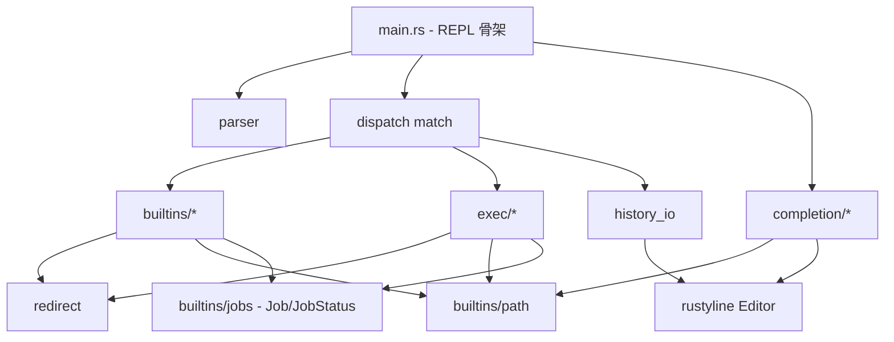

## 产品概述

对一个已实现完整功能的 Rust shell 项目（codecrafters-shell-rust）进行结构化重构与文档体系建设。在保持所有现有功能与测试 100% 通过的前提下，把当前的"巨型文件"（builtins.rs 1546 行 / completion.rs 1284 行 / main.rs 555 行 / exec.rs 499 行）按职责激进拆分为细粒度的模块化目录结构；同时建立完整的多层次文档体系（顶层 README + docs/ 四份专题文档 + 模块级 //! + 关键 API 的 rustdoc 示例），并把代码中现存的大段决策注释（>5 行）系统性迁移到 docs/DESIGN_DECISIONS.md。

## 核心特性

### 1. 代码结构激进拆分（行为零变化）

- **builtins/ 目录化**：按 9 个 builtin 各成文件（echo / pwd / cd / type / complete / jobs / history / declare）+ path.rs（PATH 查找）+ mod.rs 聚合 + BUILTINS 常量与 Job 类型独立小文件
- **completion/ 目录化**：按已有的三套独立状态机物理拆分（command.rs / argpath.rs / script.rs）+ helpers.rs（LCP / 路径分类等纯函数）+ mod.rs（ShellHelper 与 rustyline trait impl）
- **exec/ 目录化**：external.rs（单命令）+ pipeline.rs（N 段管线 + PrevOutput）+ mod.rs
- **新增 history_io.rs**：把 main.rs 中 `history -r/-w/-a` 三段内联与 `save_history_to_envfile` / 启动加载逻辑全部抽出
- **main.rs 精简**到 ≤ 150 行，仅保留 REPL 主循环骨架与 dispatch
- **parser/ 保持不变**（已是良好拆分范本）；**redirect.rs 保持不变**（52 行已足够小）
- **清理 Cargo.toml** 中未使用的 `anyhow` / `bytes` / `thiserror` 依赖

### 2. 完整文档体系

- **README.md 重写**：项目简介 + ASCII 架构图 + 模块依赖图 + 快速开始 + 已实现特性清单 + 技术选型一句话总结 + 指向 docs/ 的导航
- **docs/ARCHITECTURE.md**：分层架构图（REPL → Parser → Dispatch → Builtins/Exec → Redirect/Completion/History）+ 数据流图 + 4 条关键时序（启动 / 单次命令执行 / 后台作业生命周期 / pipeline 执行）
- **docs/DESIGN_DECISIONS.md**：8 个技术选型主题各占一章，每章统一「问题 / 选择 / 原因 / 代价 / 备选方案」五段式；承接从代码迁移出来的所有冗长决策注释
- **docs/MODULES.md**：逐模块的「职责 / 公开 API / 依赖关系 / 关键不变量」表格
- **docs/TESTING.md**：单元测试与集成测试组织、FIFO/管道验证 stdio 继承的手法、新增测试指引
- **每模块顶部 //!**：精简概述 + 指向 docs/DESIGN_DECISIONS.md 对应锚点的交叉链接
- **关键 public API 补 `# Examples`** rustdoc 代码块（parser::parse_pipeline / Pipeline / ParsedCommand / ShellHelper::new / run_pipeline / Job / find_in_path / open_sink）
- **保证 `cargo doc --no-deps --document-private-items` 0 warning**

### 3. 行内注释精简

- 所有 > 5 行的大段决策注释统一压缩为 ≤ 5 行接口说明，并附 `// 详见 docs/DESIGN_DECISIONS.md#<anchor>` 交叉链接
- 不丢失任何决策上下文（全量迁移到 docs/DESIGN_DECISIONS.md）

### 4. 不可破坏的契约

- 所有现有测试（4 个集成测试 + ~60 个 parser 单元测试）100% 通过
- codecrafters submit 通过率不下降
- 不引入新依赖；edition 2024 / rust 1.95 不变；package 元信息不变

## Tech Stack

- **语言/版本**：Rust edition 2024，rust-version 1.95（不变）
- **保留依赖**：`rustyline = "14"`（唯一实际被使用的运行时依赖）
- **清理依赖**：`anyhow` / `thiserror` / `bytes`（全 crate 搜索无引用，移除）
- **文档工具链**：`cargo doc --no-deps --document-private-items`（rustdoc）+ Markdown + mermaid（用于 docs/*.md 内嵌图）

## Implementation Approach

### 总体策略

**两阶段无功能变更重构**：先做"纯搬运"（move + 调整 use 路径 + 调整可见性），每一步搬完即 `cargo build && cargo test` 验证零回归；再做"注释迁移与精简"（把行内 >5 行的决策注释抽到 docs/DESIGN_DECISIONS.md，并在原位置留 ≤5 行交叉链接）。文档撰写贯穿全程，但**先成骨架（章节标题 + TOC）再填内容**，避免大块文本写完后因代码搬动失效。

### 关键决策与权衡

1. **目录化优先于扁平多文件**：`builtins/echo.rs` 而非 `builtins_echo.rs`，符合 Rust 社区惯例与 `parser/` 现有范本；对外通过 `pub mod` + `pub use` 保持原有 `crate::builtins::run_echo` 等导入路径稳定，避免连锁修改 main.rs。
2. **Job/JobStatus 与作业管理函数共置**：`Job` / `JobStatus` / `allocate_job_id` / `advance_job_status` / `render_done_jobs` / `retain_running_jobs` / `run_jobs` 是紧密内聚的"作业管理"概念，全部放进 `builtins/jobs.rs`；不进一步拆为 `types.rs + ops.rs`，避免过度拆分。
3. **completion/ 沿用代码已有的三套状态机边界**：当前 completion.rs 文件头注释明确划分了「命令名 / 参数路径 / 命令级脚本」三套独立 `last_tab_*` key，三者天然是物理拆分边界；helpers.rs 收纳纯函数（无 `&self` 依赖），便于单测。
4. **`pub use` 维持 API 路径稳定**：所有原 `crate::builtins::xxx` / `crate::completion::ShellHelper` / `crate::exec::run_external` 路径不变，通过 `mod.rs` 的 `pub use` 重导出实现，使 `main.rs` 的 `use builtins::{...}` 等语句改动最小化。
5. **注释迁移用锚点交叉链接**：docs/DESIGN_DECISIONS.md 每节用稳定锚点（如 `#pipeline-prev-output`），代码内交叉链接形如 `// 详见 docs/DESIGN_DECISIONS.md#pipeline-prev-output`；锚点 ID 一旦确定不再变，避免双向同步成本。
6. **history_io 与 main.rs 的边界**：抽出的函数接受 `&mut Editor<...>` 或 `&Editor<...>`，把对 rustyline 内部的依赖封装在 history_io 内；main.rs 仅调用顶层函数（`load_history_from_envfile` / `save_history_to_envfile` / `run_history_read` / `run_history_write` / `run_history_append`）。
7. **不引入新抽象**：不为 builtin 增加 `trait Builtin`，因为各 builtin 签名差异较大（部分需要 `&mut HashMap`、部分需要 `&mut Editor`），强行抽象会让 dispatch 变重；保持现有函数式风格。
8. **依赖清理时机**：放在所有代码搬运完成后，避免清理过程中误删被新增 `use` 引入的依赖（虽然实际并无，但顺序上更稳妥）。

### Implementation Notes

- **零行为变更红线**：每个"搬运"步骤完成后必须执行 `cargo build && cargo test`（包括 `tests/` 下 4 个集成测试），任意失败立即回滚该步骤。
- **可见性最小化**：跨模块共享的内部函数（如 `escape_for_double_quote` / `is_valid_identifier` / `allocate_job_id`）用 `pub(crate)` 而非 `pub`，与现有 `parser::is_name_start/is_name_cont` 风格一致。
- **rustdoc 警告 0 容忍**：迁移过程中可能引入 broken intra-doc link（如 `[`old::Path`]`），每次搬运后跑 `cargo doc --no-deps --document-private-items` 检查；新加的 `# Examples` 必须可编译（用  ````no_run` 或  ````ignore` 标注无法独立运行的片段）。
- **注释精简边界**：函数签名上方紧贴的 `///` doc 注释保留接口语义（参数/返回/错误），仅压缩超过 5 行的"决策原因"段；模块顶部 `//!` 同样适用。
- **mermaid 图表**：docs/ARCHITECTURE.md 内的架构图、数据流图、时序图统一使用 mermaid，便于版本控制 diff 与 GitHub 直接渲染；不引入 PNG 图片资源。
- **日志/错误**：不引入 log crate，沿用现有 `eprintln!` 风格；REPL 健壮性策略（静默失败 / 不阻断主循环）写进 docs/DESIGN_DECISIONS.md 而非散落注释。
- **测试可执行性**：tests/common/mod.rs 中如有 `use codecrafters_shell::...` 引用，必须确认所有重导出路径仍可达；测试代码本身不修改。

## Architecture Design

### 目标分层架构



### 模块依赖关键约束

- `parser/`：零依赖于其他业务模块（独立可单测）
- `redirect`：被 builtins/exec 共用，无反向依赖
- `builtins/path`：被 builtins/type、exec、completion 共用（PATH 查找单一数据源）
- `builtins/jobs`：定义 `Job` / `JobStatus`，被 exec 写入、main reaping 路径读取
- `completion/` 内部三套状态机相互独立，通过 helpers.rs 共享纯函数

## Directory Structure

### 总结

对 `src/` 进行目录化重构（builtins/ / completion/ / exec/ 三个目录），新增 `src/history_io.rs`，新增 `docs/` 目录承载四份专题文档，重写 `README.md`，清理 `Cargo.toml` 三项未使用依赖。`src/parser/` 与 `src/redirect.rs` 保持不变。所有原 `crate::builtins::*` / `crate::completion::*` / `crate::exec::*` 导入路径通过 `pub use` 保持稳定。

```
codecrafters-shell-rust/
├── Cargo.toml                      # [MODIFY] 移除未使用依赖 anyhow / thiserror / bytes，仅保留 rustyline；保留 package 元信息不变
├── README.md                       # [REWRITE] 项目简介 + ASCII 架构图 + 模块依赖图 + 快速开始 + 已实现特性清单（9 个 builtin + pipeline + 后台作业 + 重定向 + 变量展开 + TAB 补全 + history 文件 IO）+ 技术选型一句话总结 + 指向 docs/ 的导航
├── docs/                           # [NEW DIR] 文档体系根目录
│   ├── ARCHITECTURE.md             # [NEW] 分层架构（mermaid 图）+ 数据流图 + 4 条关键时序图（启动 / 单次命令 / 后台作业 / pipeline）+ 模块依赖矩阵
│   ├── DESIGN_DECISIONS.md         # [NEW] 8 章技术选型五段式（问题/选择/原因/代价/备选）：① 依赖选择（rustyline / 清理 anyhow-thiserror-bytes）② Rc<RefCell> vs Arc<Mutex>（单线程 REPL）③ 解析器架构（手写状态机 vs nom/chumsky）④ 后台作业 reaping（try_wait + prompt 前 vs SIGCHLD）⑤ Pipeline 实现（PrevOutput None/Buffer/ChildPipe）⑥ 重定向 sink（Box<dyn Write> + 二次物化）⑦ TAB 补全状态机（&self + Cell 内部可变性 + 三套 key + LCP 首末项算法）⑧ 测试策略（parser 单测集中 + FIFO 集成测试）；每章末附稳定锚点
│   ├── MODULES.md                  # [NEW] 逐模块表格：职责 / 公开 API / 依赖 / 关键不变量；覆盖 main / parser / builtins/* / completion/* / exec/* / redirect / history_io
│   └── TESTING.md                  # [NEW] 单元测试（parser/tests.rs 60+）+ 集成测试（tests/ 下 4 个）+ FIFO/管道验证 stdio 继承手法 + 新增测试指引 + 运行命令清单
├── src/
│   ├── main.rs                     # [MODIFY] 精简到 ≤ 150 行；仅保留 REPL 主循环骨架：rustyline 初始化、共享状态构造（completions / jobs_table / shell_vars / last_appended_len）、prompt 前 reaping 三步、readline、parse_pipeline、dispatch match 分发到 builtins/exec/history_io；移除所有 >5 行决策注释（迁移到 docs/DESIGN_DECISIONS.md）；保留 ≤5 行接口注释 + 交叉链接
│   ├── history_io.rs               # [NEW] 承接 history -r/-w/-a 三段 + save_history_to_envfile + load_history_from_envfile；公开函数：load_history_from_envfile(&mut Editor) / save_history_to_envfile(&Editor) / run_history_read(&mut Editor, path) / run_history_write(&Editor, path) / run_history_append(&Editor, path, &mut last_appended_len)；静默失败策略集中在此
│   ├── redirect.rs                 # [KEEP] 保持不变（52 行已足够小，open_file_for_redirect / open_sink / open_err_sink）；可选：在文件顶部 //! 加一句指向 docs/DESIGN_DECISIONS.md#redirect-sink 的链接
│   ├── parser/                     # [KEEP] 保持现有四文件结构不变（mod.rs / parse.rs / tokenize.rs / tests.rs）；mod.rs 顶部 //! 精简并加 docs 链接
│   │   ├── mod.rs                  # [MINOR] 头注释精简到 ≤ 20 行，详细语义说明迁到 docs/DESIGN_DECISIONS.md#parser-architecture
│   │   ├── parse.rs                # [KEEP] 不动；ParsedCommand / Pipeline 的 doc comment 补 # Examples（≤ 10 行示例代码）
│   │   ├── tokenize.rs             # [KEEP] 不动
│   │   └── tests.rs                # [KEEP] 不动
│   ├── builtins/                   # [NEW DIR] 替代原 src/builtins.rs；每个 builtin 一文件
│   │   ├── mod.rs                  # [NEW] BUILTINS 常量（const &[&str]）+ 子模块 pub mod 声明 + pub use 重导出全部 runner 与 Job 类型，使 crate::builtins::{run_echo, run_pwd, ..., Job, JobStatus, find_in_path, list_path_executables, advance_job_status, render_done_jobs, retain_running_jobs, allocate_job_id} 路径完全保持向下兼容；顶部 //! 概述 + docs 链接
│   │   ├── path.rs                 # [NEW] find_in_path + list_path_executables（PATH 查找单一数据源），从原 builtins.rs 第 84-142 行抽出；附 # Examples
│   │   ├── echo.rs                 # [NEW] run_echo（从原 builtins.rs 抽出，~10 行实现 + 精简注释）
│   │   ├── pwd.rs                  # [NEW] run_pwd
│   │   ├── cd.rs                   # [NEW] run_cd
│   │   ├── type_cmd.rs             # [NEW] run_type（命名避开 Rust 关键字 type）
│   │   ├── complete.rs             # [NEW] run_complete（注册表 -C/-p/-r 三路分派）
│   │   ├── jobs.rs                 # [NEW] Job 结构 + JobStatus enum + allocate_job_id + advance_job_status + render_done_jobs + retain_running_jobs + run_jobs；这是一个紧密内聚的"作业管理"子模块，包含约 350 行代码；顶部 //! 指向 docs/DESIGN_DECISIONS.md#background-reaping
│   │   ├── history.rs              # [NEW] run_history（渲染逻辑，仅 stdout 输出）；与 history_io.rs 协作但职责分离：history.rs 只负责渲染 &[String]，history_io.rs 负责 Editor ↔ 文件的 IO
│   │   └── declare.rs              # [NEW] run_declare + is_valid_identifier + escape_for_double_quote（NAME 字符判定与 parser::is_name_start/is_name_cont 同源，pub(crate) 暴露给 parser 调用方）
│   ├── completion/                 # [NEW DIR] 替代原 src/completion.rs；按三套状态机物理拆分
│   │   ├── mod.rs                  # [NEW] ShellHelper 结构体定义（含三个 Cell + path_executables + completions Rc）+ ShellHelper::new + Completer impl（分发到 command/argpath/script 三个子模块的处理函数）+ Hinter/Highlighter/Validator/Helper trait impl（均为默认实现）+ pub use ShellHelper；顶部 //! 概述 + docs 链接；附 # Examples 展示 ShellHelper::new 与 Editor::set_helper 用法
│   │   ├── command.rs              # [NEW] 命令名 TAB 补全状态机（builtin + PATH executables 候选源、单/多候选 LCP 扩展、双 TAB 列出）；持有对 last_tab_prefix 的访问；提供 pub(super) fn complete_command(...) -> (usize, Vec<Pair>)
│   │   ├── argpath.rs              # [NEW] 参数位置路径补全状态机（split_dir_and_name + match_files_in_dir + classify_path + format_arg_completion 链路；目录/文件分支区分；持有对 last_tab_arg_key 的访问）；提供 pub(super) fn complete_arg_path(...)
│   │   ├── script.rs               # [NEW] complete -C 注册的命令级补全脚本分支（extract_completer_context + run_completer_script + parse_completer_stdout；持有对 last_tab_script_key 的访问）；提供 pub(super) fn complete_with_script(...)
│   │   └── helpers.rs              # [NEW] 三分支共享的纯函数：longest_common_prefix（首末项算法）+ extract_arg_prefix + split_dir_and_name + match_files_in_dir + classify_path + format_arg_completion + MatchKind enum；无任何 ShellHelper 状态依赖，便于单测；附 # Examples 展示 LCP 算法
│   ├── exec/                       # [NEW DIR] 替代原 src/exec.rs
│   │   ├── mod.rs                  # [NEW] 子模块声明 + pub use run_external / run_pipeline；顶部 //! 概述 + docs 链接
│   │   ├── external.rs             # [NEW] run_external（单命令外部命令分支，从原 exec.rs 第 92-209 行抽出，~120 行）；附 # Examples
│   │   └── pipeline.rs             # [NEW] PrevOutput enum + is_pipeline_builtin + run_pipeline + cleanup_pipeline_children（约 280 行）；顶部 //! 指向 docs/DESIGN_DECISIONS.md#pipeline-prev-output
└── tests/                          # [KEEP] 全部不变（common/mod.rs / background_stdio.rs / jobs_builtin.rs / pipeline_basic.rs / pipeline_builtin.rs）；通过 pub use 维持公开 API 路径稳定，确保不需修改测试代码
```

## Key Code Structures

仅列出 1 个关键结构：completion/mod.rs 中 ShellHelper 的对外接口（保持与原版 100% 兼容是激进拆分的核心契约）：

```rust
// src/completion/mod.rs
pub struct ShellHelper {
    path_executables: Vec<String>,
    last_tab_prefix: Cell<Option<String>>,
    last_tab_arg_key: Cell<Option<(String, String)>>,
    last_tab_script_key: Cell<Option<(String, String, String)>>,
    completions: Rc<RefCell<HashMap<String, String>>>,
}

impl ShellHelper {
    pub fn new(completions: Rc<RefCell<HashMap<String, String>>>) -> Self;
}

// Completer trait impl 内部按 line[..pos] 形态分发到三个子模块：
//   command::complete_command(...)
//   argpath::complete_arg_path(...)
//   script::complete_with_script(...)
// 任一分支命中时清空对侧两个 Cell，保持三态互斥语义不变。
```

## Agent Extensions

### SubAgent

- **code-explorer**
- Purpose: 在大规模搬运代码前，对 builtins.rs / completion.rs / exec.rs 三个巨型文件进行一次系统性结构梳理（识别函数级依赖、跨模块调用点、私有 helper 的最小可见性范围），为激进拆分提供精确的迁移边界清单
- Expected outcome: 输出一份"函数 → 目标文件 + 可见性建议"映射表，覆盖三个文件中的全部 ~30 个函数与类型定义，确保拆分时无遗漏、无错位