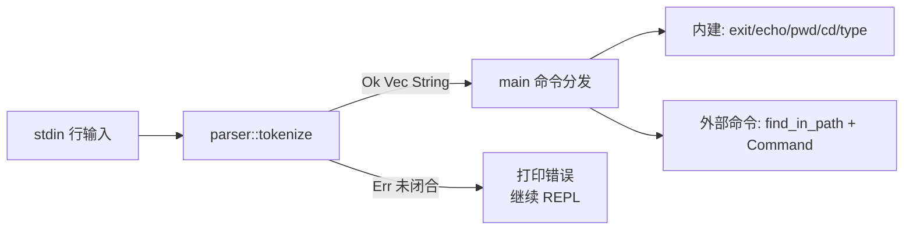

## 用户需求

为 Rust 实现的 shell 增加单引号（`'`）解析能力，使引号内的所有字符按字面量处理；同时让相邻引号串与裸字符串能拼接成同一个参数。

## 产品概述

本阶段在已有 REPL（含 `exit` / `echo` / `pwd` / `cd` / `type` 与外部命令执行）基础上，替换现有 `split_whitespace` 的朴素切分，引入支持单引号的词法分析器，使 `echo` 与外部命令（如 `cat`）均能正确接收含空格、特殊字符的参数。

## 核心功能

- 单引号内的字符（空格、`、`*`、`~`、Tab 等）全部按字面量保留，不参与折叠或扩展。
- 引号外连续空白仍作为 token 分隔符，并被折叠。
- 相邻引号串、裸字符串、空引号 `''` 可无缝拼接为同一个 argument：
- `echo 'hello    world'` → `hello    world`
- `echo 'hello''world'` → `helloworld`
- `echo hello''world` → `helloworld`
- 外部命令参数同样走该分词器，`cat '/tmp/file name'` 能把含空格路径作为单个 argv 传递给子进程。
- 未闭合单引号视为本行解析失败，打印简短错误并继续 REPL，不中断进程。
- 不在本阶段处理双引号、反斜杠转义、变量展开、通配符等。

## 技术栈

- 语言：Rust 2024 edition（沿用现有 `Cargo.toml`，不新增依赖；`anyhow` / `thiserror` / `bytes` 暂不引入新使用，保持现状）。
- 标准库：`std::io`、`std::process::Command`、`std::os::unix::process::CommandExt::arg0`（已在用）。

## 实现思路

采用「字符级状态机 + 单一输出缓冲」的最小可用分词器，对外暴露 `tokenize(input: &str) -> Result<Vec<String>, ParseError>`。

- 状态机仅两个状态：`Normal` / `InSingleQuote`。
- 维护一个 `current: String` 与一个布尔 `in_token`，用于区分「尚未开始 token」「token 已开始但可能为空」两种情况，从而正确处理 `''` 与 `hello''world` 这类相邻拼接场景。
- 遍历字符：
- `Normal` + 空白：若 `in_token` 为真，push `current` 并清零；否则跳过。
- `Normal` + `'`：切到 `InSingleQuote`，标记 `in_token = true`（不追加字符）。
- `Normal` + 其它字符：标记 `in_token = true`，追加到 `current`。
- `InSingleQuote` + `'`：切回 `Normal`，`in_token` 保持为真（不追加字符）。
- `InSingleQuote` + 任意其它字符（含空格、`\`、`$`、`* `等）：原样追加到 `current`。
- 输入结束：若仍在 `InSingleQuote` → 返回 `ParseError::UnterminatedSingleQuote`；否则若 `in_token` 为真则 flush 出最后一个 token。
- 复杂度：O(n)，仅一次线性扫描，无回溯；与 bash 单引号语义一致（不存在引号内的转义）。

## 关键技术决策

- **拆分为独立 `src/parser.rs` 模块**：用户明确选择，便于后续阶段叠加双引号 / 反斜杠 / 变量展开等规则，避免 main.rs 继续膨胀。
- **`Vec<String>` 而非 `Vec<&str>`**：因引号内容会与裸字符串拼接，必然要分配新字符串；统一所有权模型，避免生命周期纠缠。
- **`in_token` 标志而非「碰到引号就 push 空串」**：自然满足「相邻引号 / 空引号拼接」语义，无需特殊 case，零额外分支。
- **未闭合引号按错误处理**：用户已确认；与「宽松回退」相比更接近 bash 行为，便于后续阶段统一错误模型。
- **不引入 `anyhow` / `thiserror`**：当前只有一种错误变体，自定义薄 `enum ParseError` + 手写 `Display` 即可，避免无谓依赖膨胀；后续真正需要时再启用现有依赖。

## Implementation Notes

- main.rs 在拿到 `Vec<String>` 后：第一个元素作 `cmd`，其余作 `args`；空 vec（仅空白或纯 `''`？注意：`''` 应得到一个空字符串 token，即 `cmd = ""`，需在分发前判断 `cmd.is_empty()` 走 not found 分支，保持与 bash 一致）需要在 REPL 循环中显式处理。
- `echo` 分支改为 `args.join(" ")`，确保引号内空格不会被再次折叠（join 用单空格即可，因为引号内空格已经在 token 内部保留）。
- 外部命令分支 `Command::new(&path).arg0(&cmd).args(&args).status()`：传 `&Vec<String>` 切片即可，`args` 接收 `IntoIterator<Item: AsRef<OsStr>>`，`String` 天然满足。
- `exit` / `cd` / `type` 中 `parts.next()` 改为 `args.get(0).map(|s| s.as_str())`，保持原逻辑不变。
- 未闭合引号错误输出格式建议：`eprintln!("syntax error: unterminated single quote")`，再 `continue` 下一轮 REPL，避免 panic / 进程退出。
- 性能：单行通常 < 1KB，单次 O(n) 扫描 + 少量 `String` 分配；无热点风险，无需 SmallVec / 缓冲池等过度优化。
- 兼容性：所有现有阶段测试（`echo a b`、`type`、`cd`、外部命令）在分词器下行为不变，因为不含引号的输入路径仍是「按空白切分」。

## 架构设计

保持现有单 binary、扁平模块的结构，仅新增 `parser` 子模块：



## 目录结构

```
codecrafters-shell-rust/
├── src/
│   ├── main.rs    # [MODIFY] 入口与 REPL。
│   │              #   - 顶部新增 mod parser;
│   │              #   - 用 parser::tokenize(line) 替换 line.split_whitespace()；
│   │              #   - 解构出 cmd: &str（取 tokens[0]）与 args: &[String]（tokens[1..]）；
│   │              #   - 空 tokens / 空 cmd 处理：空 vec 视作空行 continue；
│   │              #   - 改写 echo 分支为 args.join(" ") 输出；
│   │              #   - exit/cd/type 取首参数改为 args.get(0)；
│   │              #   - 外部命令分支保持 .arg0(cmd).args(&args)；
│   │              #   - 解析错误（UnterminatedSingleQuote）打印 syntax error 并 continue；
│   │              #   - 现有 BUILTINS / find_in_path / cd ~ 展开等逻辑保持不变。
│   └── parser.rs  # [NEW] 命令行词法分析器。
│                  #   - pub enum ParseError { UnterminatedSingleQuote }，实现 Display / std::error::Error；
│                  #   - pub fn tokenize(input: &str) -> Result<Vec<String>, ParseError>；
│                  #   - 内部使用两状态枚举 State::{Normal, InSingleQuote} + current: String + in_token: bool；
│                  #   - 字符迭代用 input.chars()，足以处理 UTF-8（不依赖字节索引）；
│                  #   - 单元测试模块 #[cfg(test)] mod tests 覆盖：
│                  #     * 普通空白切分（"echo a b"）
│                  #     * 引号内空格保留（"echo 'hello    world'"）
│                  #     * 相邻引号拼接（"'hello''world'"）
│                  #     * 空引号 + 裸串拼接（"hello''world" / "''abc"）
│                  #     * 引号内含 $ * ~ 等特殊字符按字面量保留
│                  #     * 多个引号参数（"cat '/tmp/a b' '/tmp/c d'"）
│                  #     * 未闭合引号返回 Err；
└── Cargo.toml     # 无需修改。
```

## 关键接口

```rust
// src/parser.rs
pub enum ParseError {
    UnterminatedSingleQuote,
}

pub fn tokenize(input: &str) -> Result<Vec<String>, ParseError>;
```