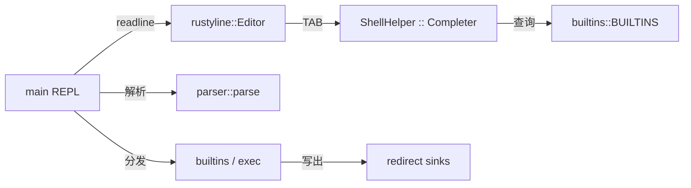

## 用户需求

为正在用 Rust 实现的 shell 增加 **Tab 自动补全 builtin 命令** 的能力。

## 产品概述

当用户在交互式 REPL 中输入 builtin 命令的前缀并按下 `<TAB>`，shell 应自动补全为完整的 builtin 名称，并在末尾追加一个空格，方便用户继续键入参数。

## 核心特性

- `ech<TAB>` → `echo `（末尾带空格）
- `exi<TAB>` → `exit `（末尾带空格）
- 前瞻性支持所有现有 builtin 的补全：`cd / echo / exit / pwd / type`
- 仅在「首词位置」触发 builtin 补全；已经在输入参数的位置不触发，避免误补
- 不破坏现有功能：解析、引号/转义、`>` / `1>` / `2>` 重定向、外部命令执行、各 builtin 行为保持一致
- Ctrl-D（EOF）正常退出 REPL；Ctrl-C（Interrupted）取消当前行、继续下一轮提示符

## 技术栈选择

- 语言/版本：Rust 2024 edition，rust-version 1.95（沿用现有 `Cargo.toml`）
- 新增依赖：**`rustyline = "14"`**（CodeCrafters 官方推荐；稳定主版本，提供 `Editor` / `Completer` / `Helper` 等核心 API）
- 复用：`anyhow` / `thiserror` 错误处理沿用；解析器 `parser::parse`、`redirect`、`exec` 模块完全保持

## 实现思路

用 `rustyline::Editor<ShellHelper>` 替换当前 `io::stdin().lock().read_line()` 的阻塞按行读取。`ShellHelper` 实现 `Completer` trait，把 builtin 名单作为候选源；TAB 默认绑定 `Complete` 动作，rustyline 在唯一候选时会直接把替换串写入行缓冲，因此只要每个候选的 replacement 末尾自带一个空格，就满足题面要求。其他 trait（`Hinter` / `Highlighter` / `Validator`）使用空实现以满足 `Helper` 的组合约束。

### 关键技术决策

1. **首词限定触发**：在 `Completer::complete` 内部检查 `line[..pos]` 是否包含空白；若包含说明已进入参数区，返回空候选 → 避免在 `echo he<TAB>` 这种位置触发 builtin 补全。
2. **替换起点固定为 0**：首词从行首开始（提示符由 rustyline 单独绘制，不计入 `line`），返回 `(0, candidates)`。
3. **`Pair.replacement` 末尾追加空格**：直接在候选构造时拼接 `format!("{} ", name)`，这是满足题目 "Add a trailing space" 的最简方案，不依赖 rustyline 的自动补尾。
4. **集中维护 builtin 名单**：在 `builtins.rs` 暴露 `pub const BUILTINS: &[&str] = &["cd", "echo", "exit", "pwd", "type"]`，让 `completion` 与未来的 `type` 命令逻辑共享同一份事实来源，避免漂移。
5. **错误信号映射**：`ReadlineError::Eof` → `break`（与现有 `Ok(0)` 等价）；`ReadlineError::Interrupted` → `continue`（Ctrl-C 体验）；其它错误打印后 `break`。

### 性能与可靠性

- 候选集是常量 `&'static [&'static str]`，补全是 O(n) 前缀匹配，n ≤ 5，开销可忽略。
- rustyline 在 Linux 下用 termios 自行管理 raw 模式与回显，无需手工 flush；启动时若不是 TTY（如重定向输入），`Editor::new()` 仍可工作，行为退化为按行读取，不影响测试管线。
- 不引入 `unsafe`、不新增全局可变状态；`ShellHelper` 无需可变性，可在 `Editor` 中以 `Some(helper)` 持有。

## 实现注意事项

- **不要改动 `parser` / `redirect` / `exec` / `builtins` 已有公开 API**，仅追加 `BUILTINS` 常量；TAB 补全是 IO 层增强，应隔离在新模块。
- `editor.readline("$ ")` 返回的字符串不含尾随 `\n`，原 `trim_end_matches(['\n','\r'])` 可保留也可移除；建议保留以保持鲁棒。
- 多候选场景（如 `e<TAB>` 同时命中 `echo` / `exit`）：本阶段测试不覆盖；按 rustyline 默认行为（列出候选、不写入）即可，无需特殊处理。后续阶段若有需求再扩展"公共前缀补全 + 列表"逻辑。
- 历史命令可选用 `editor.add_history_entry(line)`，对测试无影响，但能提升交互手感。
- 回归验证：跑通既往 stage 的解析/重定向/外部命令用例，确保 IO 层切换不引入回归。

## 架构设计

分层保持不变，仅在 IO 层（main）与新增 `completion` 之间引入一个 `Helper`：



## 目录结构

```
codecrafters-shell-rust/
├── Cargo.toml              # [MODIFY] 在 [dependencies] 增加 rustyline = "14"
└── src/
    ├── main.rs             # [MODIFY] 用 rustyline::Editor 替换 stdin().read_line 循环：
    │                       #   1) 创建 Editor::<ShellHelper, _>::new()，set_helper(Some(ShellHelper::new()))
    │                       #   2) loop 中调用 editor.readline("$ ")
    │                       #   3) 映射 Ok(line) -> 既有解析/分发逻辑；
    │                       #      Err(Eof) -> break；Err(Interrupted) -> continue；其它 -> 打印后 break
    │                       #   4) 可选 editor.add_history_entry(line.as_str())
    │                       #   5) 删除原 input: String 缓冲和 stdin.lock().read_line(...) 相关代码
    │                       #   6) 引入 mod completion; use completion::ShellHelper;
    ├── completion.rs       # [NEW] Tab 补全实现：
    │                       #   - struct ShellHelper（无字段或仅常量引用）
    │                       #   - impl Completer for ShellHelper { type Candidate = Pair; fn complete(...) }
    │                       #     * 检查 line[..pos] 不含空白，否则返回 Ok((pos, vec![]))
    │                       #     * 遍历 builtins::BUILTINS，对前缀匹配项构造
    │                       #       Pair { display: name.to_string(), replacement: format!("{} ", name) }
    │                       #     * 返回 Ok((0, candidates))
    │                       #   - impl Hinter / Highlighter / Validator（空实现，使用默认关联类型）
    │                       #   - impl Helper for ShellHelper（marker，无方法）
    ├── builtins.rs         # [MODIFY] 新增 pub const BUILTINS: &[&str] = &["cd", "echo", "exit", "pwd", "type"];
    │                       #   作为 completion 与未来 type 命令的共享事实来源；不动既有函数
    ├── parser/             # [KEEP] 不修改
    ├── redirect.rs         # [KEEP] 不修改
    └── exec.rs             # [KEEP] 不修改
```

## 关键代码结构（接口契约）

```rust
// src/builtins.rs（新增常量）
pub const BUILTINS: &[&str] = &["cd", "echo", "exit", "pwd", "type"];

// src/completion.rs（接口签名，无实现体）
use rustyline::completion::{Completer, Pair};
use rustyline::{Context, Result};

pub struct ShellHelper;

impl ShellHelper {
    pub fn new() -> Self;
}

impl Completer for ShellHelper {
    type Candidate = Pair;
    fn complete(&self, line: &str, pos: usize, ctx: &Context<'_>)
        -> Result<(usize, Vec<Pair>)>;
}
// 同时为 ShellHelper 实现 Hinter / Highlighter / Validator / Helper（均为空/默认）
```