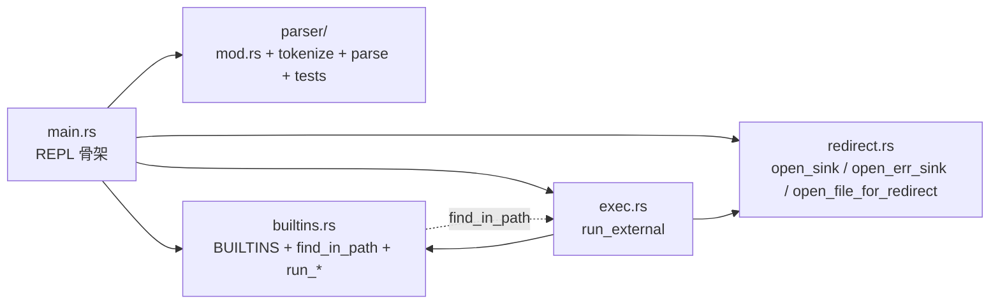

## 用户需求

当前仓库仅 `src/main.rs`（317 行）与 `src/parser.rs`（1103 行）两个源文件，单文件职责过载、密度过高。需要按职责拆分到多个模块，提升可读性与可维护性。

## 核心目标

- **零行为变更**：纯结构重构，所有现有 63 个单元测试与 codecrafters spec 端到端样例全部保持通过。
- **激进粒度（A 方案）**：parser 拆为 `parser/` 子模块目录（tokenize / parse / tests 三文件），main 拆出 `builtins` / `redirect` / `exec` 三个独立模块。
- **测试就位（Rust 最佳实践）**：保留 `#[cfg(test)] mod tests` 单元测试形态，仅把 parser 的 tests 模块从内联搬迁至独立文件 `src/parser/tests.rs`，继续 `use super::*` 访问内部 API。
- **对外路径稳定**：`parser::parse` / `parser::tokenize` / `parser::ParsedCommand` / `parser::ParseError` 访问路径不变（由 `parser/mod.rs` 用 `pub use` 重导出）。
- **顺手统一**：把 `main` 内联的 `cd` 分支抽成 `run_cd` 函数，与其它 builtin（echo/pwd/type）形态对齐。

## 验收标准

- 文件数从 2 涨到 8；最大非测试文件 < 200 行；`main.rs` 缩至 ~60 行的 REPL 骨架。
- `cargo build` / `cargo build --release` 零警告。
- `cargo test` **63/63** 全绿，无新增、无修改既有断言。
- 端到端回放 `2>>` stage spec 的 6 条样例，行为完全一致。

## 技术栈

沿用当前项目栈：Rust 2021 + 标准库（`std::fs` / `std::io` / `std::process` / `std::os::unix`），无新增依赖、`Cargo.toml` 不动。

## 实施策略

**纯代码迁移 + 模块化重导出**，不动函数签名、不动语义、不删注释。所有移动以「函数为单位整体搬迁，doc-comment 紧贴目标函数」为铁律，避免文档与实现错位。

### 关键决策

1. **parser 用 `mod.rs` 目录形式（而非 3 个平级 `parser_*.rs`）**：Rust 2018+ 推荐写法，目录隔离子模块、`src/` 顶层只看到逻辑单元。`mod.rs` 内 `pub use` 重导出，对外 API 路径零变化。
2. **tests 保留单元测试形态、迁到独立文件**：理由——(a) 大量测试访问 `tokenize` / `ParsedCommand` 等模块内符号，迁到顶级 `tests/` 集成测试目录需扩大可见性、暴露面增大；(b) The Rust Book Ch.11 主张单元测试与实现同模块；(c) 编译产物等价、`cargo test` 行为完全不变。
3. **`ParseError` 留在 `parser/mod.rs`**：它是 `tokenize` 与 `parse` 共享的错误类型，放顶层避免循环依赖、两个子模块 `use super::ParseError` 即可。
4. **`State` 枚举留在 `tokenize.rs`**：仅 tokenize 内部状态机使用，tests 不引用，无需暴露（保持 `enum State { ... }` 私有）。
5. **`run_external` 接管整个外部命令分支**：把 main 内 `_ => { ... }` 那 60 行（find_in_path 查找 → Stdio 物化 → 提前 drop sink → Command spawn → 失败回退）整体封装为函数，参数透传 `&ParsedCommand` + 移交 `Box<dyn Write>` sink 所有权（exec.rs 内 drop）。
6. **`find_in_path` 留在 `builtins.rs`**：被 `run_type` 与 `run_external` 共用；exec.rs 用 `use crate::builtins::find_in_path` 引用，避免循环依赖（builtins 不依赖 exec）。

### 实施注意事项

- **可见性最小化**：parser 内部 `tokenize` / `parse` / `ParsedCommand` 子模块定义为 `pub(crate)` 即可（被 `mod.rs` 的 `pub use` 再导出后对 main 表现为 `pub`）；`State` 保持私有。builtins / redirect / exec 模块的对外函数用 `pub(crate)`。
- **注释保全**：parser.rs 头注释（lines 1-30）整体迁到 `parser/mod.rs` 顶部，包含本仓库已有的「6 类重定向操作符」与「stdout/stderr 正交」段落；`ParsedCommand` doc（含上轮新加的 `stderr_append` 正交说明）、`open_sink` / `open_err_sink` / `open_file_for_redirect` 的 doc 一并整段迁移。
- **drop 顺序**：`run_external` 内仍要在 `Command::spawn` 之前 `drop(sink); drop(err_sink);`——这是上 stage 验证过的关键不变量，迁移时一并搬入函数体并保留原注释。
- **不改 use 路径风格**：现在用 `std::fs::File` 等具体路径而非 prelude；迁移时仅把 main.rs 顶部对应 `use` 拆分到各 new 文件，避免冗余。
- **err_sink 类型一致性**：`run_cd` 与 `run_pwd` 已使用 `&mut dyn Write`，`run_external` 改为接收 `Box<dyn Write>`（拥有权移交，便于 drop）——这是与现有内联代码语义对齐的最自然签名。

### 架构关系



## 目录结构

```
src/
├── main.rs              # [REWRITE] 缩至 ~60 行。仅保留：mod 声明（parser/builtins/redirect/exec）+ fn main 的 REPL 骨架（读输入 → parser::parse → 跳过空行/空 argv → open_sink/open_err_sink → match cmd 分发 exit/echo/pwd/cd/type/_ => exec::run_external）。删除所有 helper 函数定义与原 _ => { ... } 内联逻辑。
├── builtins.rs          # [NEW] ~120 行。Pub(crate) 接口：BUILTINS 常量、find_in_path、run_echo、run_pwd、run_type、run_cd（新抽函数，从 main.rs line 215-249 整体搬入；签名 fn run_cd(err_sink: &mut dyn Write, args: &[String])，保留 HOME 缺失处理 + ~ 展开 + std::env::set_current_dir 调用 + 错误信息走 err_sink 的全部原有逻辑与注释）。
├── redirect.rs          # [NEW] ~55 行。Pub(crate) 接口：open_file_for_redirect、open_sink、open_err_sink，从 main.rs line 82-116 整体搬入，doc-comment 完整保留（含「append=true 走 OpenOptions.create(true).append(true).open()」「append=false 走 File::create」「None → io::stdout()/io::stderr()」语义说明）。
├── exec.rs              # [NEW] ~80 行。Pub(crate) run_external 函数：参数 (cmd: &str, line: &str, args: &[String], parsed: &parser::ParsedCommand, sink: Box<dyn Write>, err_sink: Box<dyn Write>)；从 main.rs line 255-313 搬入：find_in_path 查找、stdout/stderr Stdio::from(open_file_for_redirect) 或 Stdio::inherit 物化、drop(sink)/drop(err_sink)、Command::new(path).arg0(cmd).args(args).stdout(...).stderr(...).status()、失败回退 "{}: command not found" 写 err_sink。保留所有现有关键路径注释（fd 拥有权释放、append 共享 O_APPEND 语义等）。
└── parser/
    ├── mod.rs           # [NEW] ~80 行。从原 src/parser.rs 搬入：头注释（lines 1-30，含上 stage 新增的 stdout/stderr 正交段落）、ParseError 枚举（lines 37-66）、impl Display for ParseError、impl std::error::Error。声明 mod tokenize; mod parse; #[cfg(test)] mod tests; 并 pub use tokenize::tokenize; pub use parse::{parse, ParsedCommand};—保证 main 端 use parser; parser::parse(...) 等路径完全不变。
    ├── tokenize.rs      # [NEW] ~165 行。从原 src/parser.rs 搬入：State enum（保持私有）、pub(crate) fn tokenize。文件顶部 use super::ParseError；保留 `>` / `1>` / `2>` / `>>` / `1>>` / `2>>` 合并的全部内联注释。
    ├── parse.rs         # [NEW] ~95 行。从原 src/parser.rs 搬入：pub(crate) struct ParsedCommand（含所有字段 doc，特别保留 stderr_append 的正交性说明）、pub(crate) fn parse。文件顶部 use super::{ParseError, tokenize::tokenize}；保留 6 类操作符识别与 last-write-wins 注释。
    └── tests.rs         # [NEW] ~782 行。从原 src/parser.rs lines 322-1103 整体搬入 #[cfg(test)] mod 内容（去掉外层 mod tests 包装层，因为本文件本身已被 mod.rs 用 #[cfg(test)] mod tests; 声明）。文件首行 use super::*;（访问 parse / tokenize / ParsedCommand / ParseError）。
```

## 风险与回滚

- **API 路径破坏风险**：main.rs 当前用 `parser::parse(line)`、依赖 `parsed.stdout_redirect` 等字段访问——`pub use` 重导出后路径不变，但要逐一核对编译报错。
- **可见性收紧风险**：当前 `tokenize` / `ParsedCommand` 是裸 `pub`；迁移后改 `pub(crate)` 由 `mod.rs` `pub use` 暴露，对 crate 内部使用完全等价。若 codecrafters 自动测试 harness 外部链接本 crate（实际不会，二进制 crate），需放宽——预扫描确认 crate-type 是 `[[bin]]` 而非 `[lib]`，无外部消费者。
- **回滚成本**：每个步骤都是「整段搬迁」，git diff 清晰，若任一步 cargo test 失败可立即 revert。