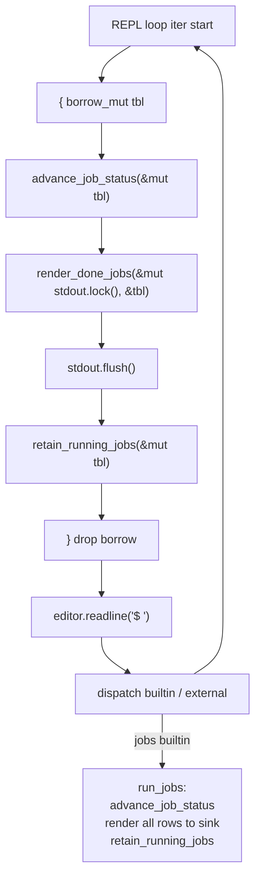

## 用户需求

在 codecrafters Rust shell 的「Manage Jobs」基础上新增**Reaping Before Each Prompt**能力——shell 在每次绘制 `$ ` 提示符之前，对所有后台作业做一次非阻塞探测，将已退出作业以标准 `Done` 行格式打印到 stdout，并立刻从作业表中移除，使该作业在后续 `jobs` 中不再出现。

## 核心功能

- **每轮提示符前自动 reap**：在阻塞 readline 之前完成「状态推进 → 渲染 Done 行 → 从作业表移除」三步原子动作
- **Done 行恰好出现一次**：自动 reap 路径与 `jobs` 内建路径任一先触发即渲染并移除，避免重复
- **Marker 基于联合视图重算**：渲染 Done 行时，`+`/`-`/ `` 必须基于「Done 项 + 仍 Running 项」全集索引计算，复刻题面 `[1]-  Done … sleep 5`（同时存在 job 2 Running）的关键场景
- **行为契约**：Done 行格式 `"[<id><mark>  Done                    <command>\n"`（status 字段总宽 24，无尾  `&`），写入 shell 自身 stdout，不受 `>`/`2>` 重定向影响
- **逻辑共用**：自动 reap 路径与 `jobs` 内建共享同一组原子函数（状态推进 / 移除 Done），保证两条路径行为完全一致

## Tech Stack

- 语言/工具链：Rust 2021、`std::process::Child::try_wait()` 非阻塞收尾、`rustyline` REPL（沿用现有依赖，不引入新 crate）
- 测试：`cargo test` 单元测试 + 集成测试，集成测试用 `mkfifo` 命令 + `Command::spawn` 二进制驱动子进程

## 实现策略

### 三函数原子拆分（用户确认 q2=C）

将现有 `reap_finished_jobs` 拆为三个**单一职责**的原子函数，由两条调用路径各自组合，避免在「自动 reap 写 stdout」与「jobs 内建写 sink」之间产生职责耦合：

```rust
/// 仅对 Running 项调 try_wait() 推进状态至 Done；不渲染、不修改 Vec 长度。
pub fn advance_job_status(jobs: &mut [Job]);

/// 按整体 Vec 索引计算 mark（联合视图），仅对 Done 项写一行到 sink；不修改 Vec。
/// Running 项参与索引基线但不输出，复刻 bash `[1]-  Done` 场景。
pub fn render_done_jobs(sink: &mut dyn Write, jobs: &[Job]) -> io::Result<()>;

/// 一次性 retain，移除所有 Done 项；Child 已被 try_wait 收尾，drop 即无僵尸。
pub fn retain_running_jobs(jobs: &mut Vec<Job>);
```

### 调用方组合

- **REPL prompt 前（main.rs）**：`advance_job_status` → `render_done_jobs(&mut io::stdout().lock(), &tbl)` → `flush()` → `retain_running_jobs`。Done 行直接写 `io::stdout()`（用户确认 q1=A），`flush()` 确保在 rustyline 绘制 prompt 之前落盘，错误吞掉以保证 REPL 不被 reap 路径中断
- **`run_jobs` 内建（builtins.rs）**：`advance_job_status` → 沿用既有「单循环渲染所有 Running+Done 行到传入 sink」逻辑（保留 q3=A 兜底契约）→ `retain_running_jobs`。**不**调用 `render_done_jobs`（避免误把 Done 行同时写 sink + stdout 重复）

### 关键技术决策

- **为什么自动 reap 写 `io::stdout()` 而非 sink**：自动 reap 不在任何具体命令的执行上下文中，bash 真实行为也是 shell 自身 stdout，无 `>` 重定向语义；codecrafters tester 抓取的正是 shell 进程 stdout
- **为什么 marker 必须基于「Done + Running 全集」**：题面示例 1 中 `sleep 5` 完成时输出 `[1]-`（不是 `+`），因为彼时 `sleep 100` 才是 last。`render_done_jobs` 内部遍历完整 `&[Job]`，对每个 idx 算 mark，但 `if status == Done` 时才 `writeln!`，Running 项参与索引基线但不输出
- **为什么不在 `reap_finished_jobs` 内部一站式渲染**：自动 reap 与 `jobs` 写入目标不同（stdout vs sink），且 `jobs` 路径需要在同一行格式中混合 Running+Done（用户确认 q3=A 保留 jobs 兜底渲染）；拆分原子函数避免双 sink 参数的耦合签名
- **borrow_mut 作用域控制**：自动 reap 块严格收敛在 `{ }` 内，绝不跨越下方阻塞的 `editor.readline()`，否则 dispatch 借用 panic（沿用上一阶段已验证模式）

### 性能 & 可靠性

- `try_wait()` 是 `waitpid(WNOHANG)` 系统调用，O(jobs.len())；典型作业数 < 10，每轮 prompt 前一次扫描成本可忽略
- `io::stdout().lock()` 取一次锁批量写所有 Done 行 + flush，避免逐行加锁开销
- 错误处理：自动 reap 路径所有 IO 错误吞掉（写 stdout 失败已无意义渲染目标），保证 REPL 鲁棒性

### 避免技术债

- **沿用现有 mark 计算逻辑**：`run_jobs` 既有 `idx == last_idx ? '+' : idx + 1 == last_idx ? '-' : ' '` 模式直接复用进 `render_done_jobs`，单一来源
- **沿用现有格式契约**：24 宽 status 填充、Done 行无尾  `&`、Running 行追加  `&`——所有上一阶段单测保持原断言不动

## Implementation Notes

- **flush 必要性**：`io::stdout()` 是行缓冲，但 rustyline 进入 raw mode 后绘制 prompt 走独立路径；不 flush 可能导致 Done 行滞留缓冲，出现在 prompt 之后
- **空作业表无副作用**：三个原子函数对空切片/空 Vec 必须均不 panic、不写任何字节
- **集成测试 `jobs_done_then_removed` 节奏调整**：本阶段后，写 fifo + sleep 500ms 期间，下一行 `jobs` 输入会先触发 prompt 前自动 reap，Done 行可能出现在 `jobs` 之前的 stdout 区段（非 `jobs` 自身渲染）。断言策略改为「Done 行在 END_SENTINEL_1 与 END_SENTINEL_2 之间出现且仅出现一次」，不再假设具体由哪条路径渲染
- **Blast radius**：仅修改 `src/builtins.rs`、`src/main.rs`、`tests/jobs_builtin.rs`；`exec.rs`/`parser.rs`/`completion.rs`/`redirect.rs` 不动；`Job`/`JobStatus`/`BUILTINS` 不动
- **clippy baseline**：本阶段保持零新增警告，不修复 11 条 pre-existing；`cargo clippy --all-targets`（默认级别）通过即可

## Architecture Design



数据流：`Rc<RefCell<Vec<Job>>>` jobs_table 为单一数据源；自动 reap 与 `run_jobs` 是仅有的两个 mut 借用方，串行 REPL 节奏天然不并发。

## Directory Structure

```
project-root/
├── src/
│   ├── builtins.rs   # [MODIFY] 拆分 reap_finished_jobs 为三个原子 pub fn:
│   │                 #   - advance_job_status(&mut [Job]): try_wait 推进 Running→Done
│   │                 #   - render_done_jobs(&mut dyn Write, &[Job]) -> io::Result<()>:
│   │                 #     遍历 &[Job] 全集，按 idx 算 mark（last→'+', last-1→'-', else→' '），
:                     #     只对 Done 项 writeln 标准格式（24 宽 status，无尾 &）
│   │                 #   - retain_running_jobs(&mut Vec<Job>): retain(|j| j.status != Done)
│   │                 # 删除原 reap_finished_jobs（或保留为薄封装兼容旧测试，见 todolist）
│   │                 # 改造 run_jobs：内部用 advance_job_status + 现有单循环渲染 + retain_running_jobs；
│   │                 # 保持既有格式契约和 Done 兜底渲染，5 条原有单测断言不动
│   │                 # 新增 3 条单测：advance 仅推进状态、render_done 联合视图 marker、retain 单次移除
│   └── main.rs       # [MODIFY] use 导入改为新三函数；REPL loop 顶部 reap 块改为：
│                     #   { let mut tbl = jobs_table.borrow_mut();
│                     #     advance_job_status(&mut tbl);
│                     #     let mut out = io::stdout().lock();
│                     #     let _ = render_done_jobs(&mut out, &tbl);
│                     #     let _ = out.flush();
│                     #     retain_running_jobs(&mut tbl); }
│                     # borrow_mut 严格收敛在块内，绝不跨越 editor.readline()
└── tests/
    └── jobs_builtin.rs  # [MODIFY] 调整 jobs_done_then_removed 断言为「Done 行在窗口内出现一次」；
                         # [NEW] 新增 done_appears_before_next_prompt 端到端测试：
                         #   - mkfifo 两个 fifo；spawn cat fifo1 & + cat fifo2 &
                         #   - 写 fifo1 关闭让 job 1 EOF 退出
                         #   - 喂 echo BANANA + END_SENTINEL
                         #   - drain stdout 直到见到 END_SENTINEL
                         #   - 断言：BANANA 之后、END_SENTINEL 之前出现 [1]-  Done … cat …
                         #     （marker 是 `-` 而非 `+`，验证联合视图）
                         #   - 再喂 jobs + END2，断言窗口内仅 [2]+  Running cat fifo2 &，无 [1]
                         #   - Cleanup guard 清理两个 fifo
```

## Key Code Structures

```rust
// src/builtins.rs 新增/重构（仅签名层面，实现细节在 todolist 中执行）

pub fn advance_job_status(jobs: &mut [Job]);

pub fn render_done_jobs(sink: &mut dyn Write, jobs: &[Job]) -> io::Result<()>;

pub fn retain_running_jobs(jobs: &mut Vec<Job>);
```

mark 计算（在 `render_done_jobs` 与 `run_jobs` 中复用同一规则）：

```
last_idx = jobs.len() - 1
mark(idx) = if idx == last_idx { '+' }
            else if idx + 1 == last_idx { '-' }
            else { ' ' }
```

`render_done_jobs` 仅当 `jobs[idx].status == Done` 时写行；Running 项贡献索引基线但不输出。