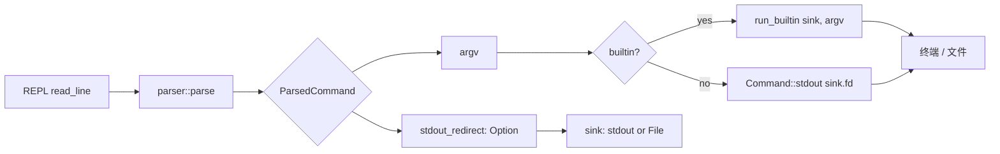

## 用户需求

为 Rust 实现的 codecrafters shell 新增 stdout 重定向能力（`>` 与 `1>`），让 stdout 写入指定文件，stderr 保持出现在终端。

## 产品概述

本阶段在现有 REPL（builtin + 外部命令分发）之上叠加一层重定向解析与执行层。Shell 在解析输入时识别 `>` / `1>` 操作符，把其后第一个 token 作为目标文件路径，并在执行命令时把 stdout 写入该文件（覆盖模式）；stderr 始终继承终端，与 spec 完全对齐。

## 核心功能

- 解析 `>` 与 `1>` 为重定向操作符，两者完全等价；支持空格分隔（`echo a > out`）与紧贴写法（`echo a>out`、`echo a 1>out`）
- 引号内（单 / 双引号）的 `>` 仍按字面量处理，不切分
- 目标文件不存在则创建；已存在则截断覆盖（不追加）
- stderr 不被重定向，错误信息仍出现在终端
- 同时支持 **builtin 命令**（echo / pwd / type）与 **外部命令** 的重定向
- 重定向语法错误（如 `echo hello >`）按错误打印到 stderr，REPL 不中断
- 目标文件打开失败（路径父目录不存在 / 无权限）按错误打印到 stderr，REPL 不中断

## 端到端样例

- `echo Hello James 1> /tmp/foo/foo.md` → 文件含 `Hello James`
- `ls /tmp/baz > /tmp/foo/baz.md` → 文件含目录内容
- `cat /tmp/baz/blueberry nonexistent 1> /tmp/foo/quz.md` → 错误在终端、文件仅含 `blueberry`

## Tech Stack

- 语言：Rust（沿用现有 `src/main.rs` + `src/parser.rs` 双文件结构，**不引入新 crate**）
- 标准库：`std::fs::File`、`std::io::{self, Write}`、`std::process::{Command, Stdio}`
- 测试：`cargo test`，沿用 `src/parser.rs` 末尾 `mod tests` 风格

## Implementation Approach

**分层策略**（采用澄清轮拍板的 Q1=A、Q2=B、Q3=A 组合）：

1. **词法层（tokenize）**：在 `Normal` 态新增对 `>` / `1>` 的切分；忠实反映源文本（输出独立 token `">"` 或 `"1>"`），引号内仍按字面量。既有 32 个单测 0 回归（已通读确认无任何测试输入含 `>`）。
2. **语法层（parse）**：新增 `pub fn parse(input: &str) -> Result<ParsedCommand, ParseError>`，内部调用 `tokenize` 后一次性扫描 token 序列，把 `>` / `1>` 后的 token 提取为 `stdout_redirect`，归一化 `1>` 与 `>` 等价；其余 token 作为 `argv`。
3. **执行层（main.rs REPL）**：根据 `ParsedCommand.stdout_redirect` 决定 sink：

- builtin（echo / pwd / type）改造为接收 `&mut dyn Write` 写入；无重定向 → `io::stdout().lock()`，有重定向 → `File::create(path)`
- 外部命令直接 `Command::stdout(file)`（`File` 实现 `Into<Stdio>`），stderr 不动（默认 inherit）
- cd / exit 无 stdout，保持原样

**关键技术决策与权衡**：

- **`1>` 归一化集中在 parse 层**：tokenize 只忠实切分（输出 `"1>"`），归一化在 parse 层完成；后续易扩展 `2>`（stderr 重定向）。
- **复用 `tokenize` 公开 API 与返回类型**：避免大面积修改既有 32 个测试；新增能力以「切分粒度叠加」+「上层 parse 函数」两种方式增量引入。
- **builtin 走 `&mut dyn Write` 而非 dup2**：纯 Rust、无 unsafe、无 libc 依赖；动态分发开销可忽略（每条命令一次）。
- **stderr 严格保持继承**：外部命令绝不调用 `.stderr(...)`；builtin 仍用 `eprintln!`。

**复杂度**：tokenize 单次线性扫描 O(n)；parse 后处理 O(token 数)；执行层文件 open 1 次系统调用。无性能热点。

## Implementation Notes

- **tokenize 的 `>` 切分规则**（关键防回归点）：在 `State::Normal` 分支匹配 `'>'`：
- 若 `in_token && current == "1"` → 把 `current` 替换为 `"1>"` 并 flush（识别 `1>` 紧贴或 `1 >` 这两种形态需谨慎：仅当 `1` 与 `>` 紧邻且无空白分隔时才合并，可通过「在 `'1'` 字符 push 后立刻 lookahead 判断」或「在 `'>'` 处回看 `current` 是否恰为 `"1"` 且无空白干扰」实现。**推荐后者**：在 `'>'` 处判断 `in_token && current == "1"`——因为空白会导致 `current` 提前 flush 为空，所以 `current == "1"` 隐含「`1` 与 `>` 之间无空白」）
- 否则：若 `in_token` 先 flush `current`，再单独 push `">"` 作为独立 token，重置 `in_token = false`
- `State::InSingleQuote` / `InDoubleQuote` 分支保持不动 → 引号内 `>` 仍按字面量
- **ParseError 扩展**：新增 `MissingRedirectTarget` 变体，`Display` 文本如 `syntax error: missing redirect target`
- **builtin sink 改造**：`writeln!(sink, ...)` 的 `io::Error` 在 REPL 主循环统一 `eprintln!("shell: write error: {}", e)` 后继续下一轮，避免静默丢错
- **File 打开失败**：`eprintln!("{}: {}: {}", cmd_or_shell_label, target, e)` 后跳过本轮命令执行（不退出 REPL）
- **零回归保证**：先确认 `cargo test` 既有 32 个用例全绿，再叠加新功能；新增 ≥8 个单测覆盖 tokenize 切分 + parse 结构化
- **复用既有模式**：`find_in_path`、`Command::new(path).arg0(cmd).args(argv)` 全部沿用，不改签名
- **blast radius**：`tokenize` 公开签名不变；新增 `parse()` 与 `ParsedCommand` 是纯增量 API；main.rs 仅替换调用点 + 改造 3 个 builtin 分支

## Architecture Design

保持双文件结构，分层清晰：



- `parser.rs` 内部分层：`tokenize`（词法）→ `parse`（语法 + 结构化）；公开两个函数，`tokenize` 保留兼容
- `main.rs` 内部分层：REPL 循环 → sink 准备 → 命令分发；builtin 抽出独立小函数以便接收 sink 参数（如 `run_echo`、`run_pwd`、`run_type`）

## Directory Structure

```
codecrafters-shell-rust/
├── src/
│   ├── parser.rs   # [MODIFY] 1) State::Normal 分支扩展识别 '>' / '1>' 为独立 token；
│   │               #          2) 新增 pub struct ParsedCommand { pub argv: Vec<String>,
│   │               #             pub stdout_redirect: Option<String> }；
│   │               #          3) 新增 pub fn parse(input: &str) -> Result<ParsedCommand, ParseError>，
│   │               #             内部调用 tokenize 后扫描 token 序列，把 '>'/'1>' 归一化并抽出
│   │               #             下一个 token 作为 stdout_redirect；
│   │               #          4) ParseError 新增 MissingRedirectTarget 变体（含 Display 文案）；
│   │               #          5) 测试模块追加 ≥8 个新单测：
│   │               #             - tokenize 层：'>' 独立 token、'1>' 独立 token、
│   │               #               echo hello>file 紧贴拆分、单/双引号内 '>' 字面量
│   │               #             - parse 层：argv+target 正确切分、'1>' 与 '>' 等价、
│   │               #               '>' 后无 target 报 MissingRedirectTarget、无重定向时 None
│   │               #          既有 32 个 tokenize 测试必须全部保持绿色
│   └── main.rs     # [MODIFY] 1) 调用点 parser::tokenize → parser::parse；处理新错误变体；
│                   #          2) 新增 sink 准备：根据 stdout_redirect 决定
│                   #             Box<dyn Write> = io::stdout().lock() 或 File::create(path)；
│                   #             File 打开失败 eprintln! 后跳过本轮，REPL 不中断；
│                   #          3) 抽出 run_echo / run_pwd / run_type 三个小函数，
│                   #             签名形如 fn run_echo(sink: &mut dyn Write, args: &[String]) -> io::Result<()>；
│                   #             把原有 println! 改写为 writeln!(sink, ...)；
│                   #          4) 外部命令分支：Command::new(path).arg0(cmd).args(argv)
│                   #             .stdout(file_or_inherit).status()；stderr 不显式设置；
│                   #          5) cd / exit 分支保持原样；
│                   #          6) writeln! 的 io::Error 在主循环统一打印到 stderr 后 continue
└── (Cargo.toml 不动，不新增依赖)
```

## Key Code Structures

```rust
// src/parser.rs 新增公开 API（仅签名 + 字段，不含实现体）
pub struct ParsedCommand {
    pub argv: Vec<String>,
    pub stdout_redirect: Option<String>,
}

pub enum ParseError {
    UnterminatedSingleQuote,
    UnterminatedDoubleQuote,
    TrailingBackslash,
    MissingRedirectTarget, // 新增
}

pub fn parse(input: &str) -> Result<ParsedCommand, ParseError>;
// 既有 pub fn tokenize(input: &str) -> Result<Vec<String>, ParseError> 保持不变
```