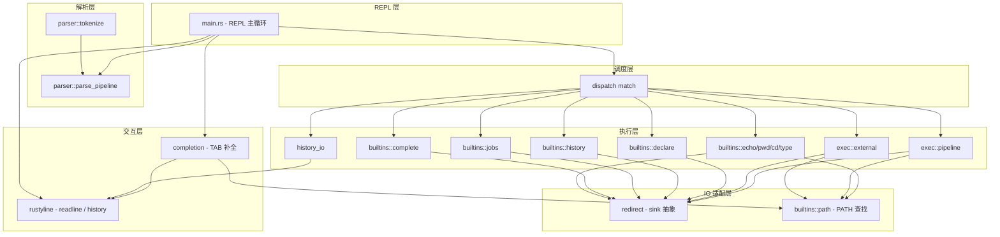
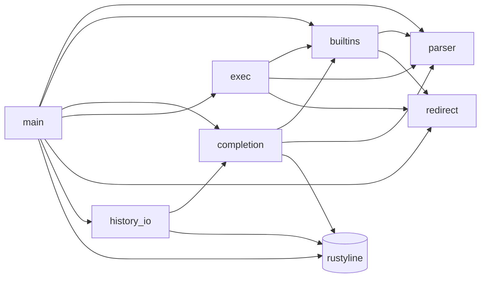
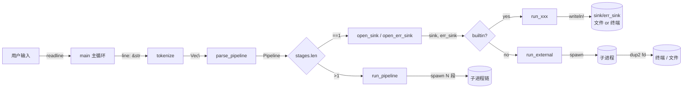
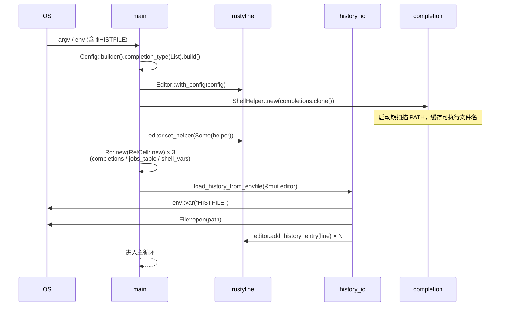
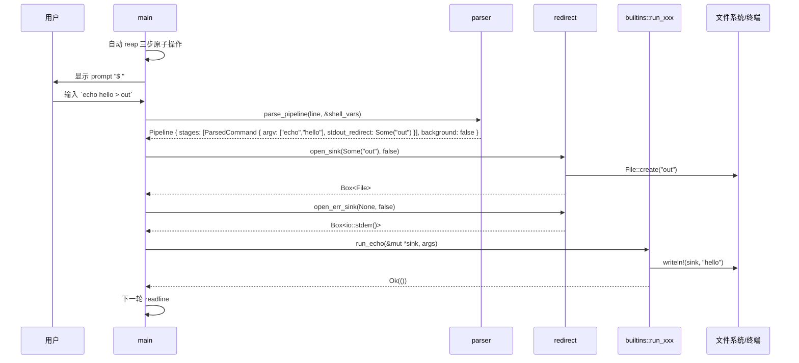
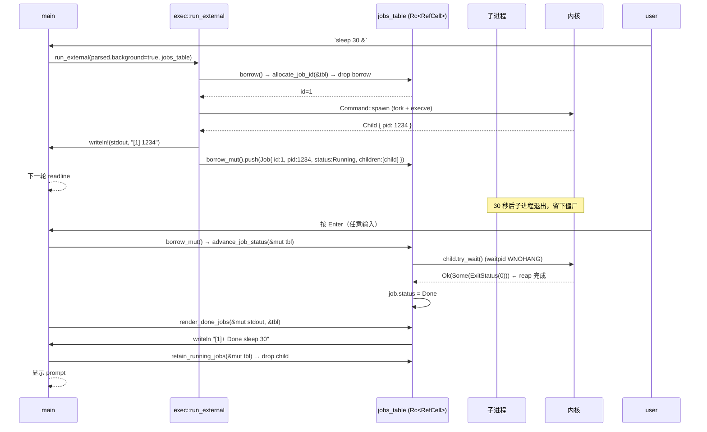
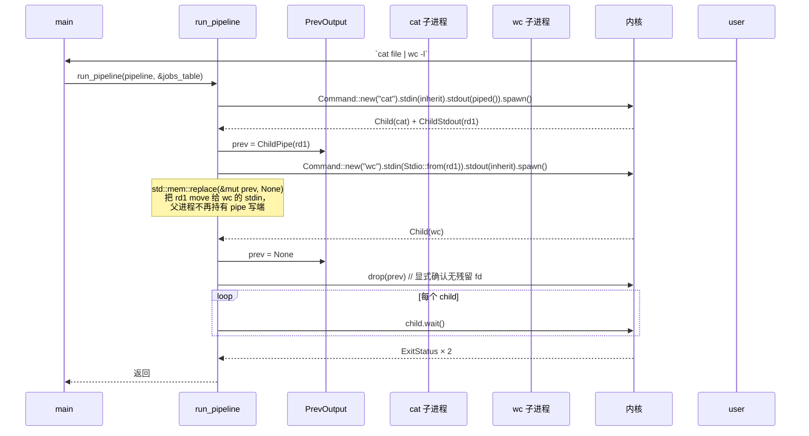

# 架构总览

> 本文档描述 `codecrafters-shell-rust` 的分层架构、模块依赖、数据流与关键时序。
> 决策细节请见 [DESIGN_DECISIONS.md](./DESIGN_DECISIONS.md)；逐模块清单请见 [MODULES.md](./MODULES.md)。

## 目录

- [1. 分层架构](#1-分层架构)
- [2. 模块依赖图](#2-模块依赖图)
- [3. 数据流](#3-数据流)
- [4. 关键时序](#4-关键时序)
  - [4.1 启动](#41-启动)
  - [4.2 单次命令执行](#42-单次命令执行)
  - [4.3 后台作业生命周期](#43-后台作业生命周期)
  - [4.4 Pipeline 执行](#44-pipeline-执行)
- [5. 模块依赖矩阵](#5-模块依赖矩阵)

## 1. 分层架构

每一层有明确的职责边界：

- **REPL 层**：拉起 rustyline、维护共享状态、prompt 前 reap、读取一行、转发到调度层。详见 [main.rs](../src/main.rs)。
- **解析层**：纯函数，无 IO。输入 `&str` + `&HashMap` 变量后端，输出 `Pipeline / ParsedCommand` 或 `ParseError`。
- **调度层**：dispatch match 把命令名映射到 builtin runner 或 `exec::run_external` / `exec::run_pipeline`。
- **执行层**：builtin / 外部命令 / pipeline 各自的运行逻辑。
- **IO 适配层**：`redirect` 提供 `Box<dyn Write>` sink 统一抽象；`builtins::path` 提供 PATH 查找单一数据源。
- **交互层**：rustyline readline + ShellHelper TAB 补全。

## 2. 模块依赖图

**无环依赖**：`parser` 与 `redirect` 是叶节点（不依赖任何业务模块）；`completion` / `exec` / `history_io` 互不依赖。

## 3. 数据流

关键数据流转换：

| 阶段 | 输入 | 输出 | 模块 |
|---|---|---|---|
| 词法 | `&str` line | `Vec<String>` tokens | `parser::tokenize` |
| 语法 | tokens | `Pipeline { stages: Vec<ParsedCommand>, background }` | `parser::parse_pipeline` |
| 重定向打开 | `Option<&str>` path + `bool` append | `Box<dyn Write>` sink | `redirect::open_sink` |
| 执行 | `ParsedCommand` + `sink/err_sink` | `io::Result<()>` 或子进程退出码 | builtins / exec |

## 4. 关键时序

### 4.1 启动

### 4.2 单次命令执行

### 4.3 后台作业生命周期

### 4.4 Pipeline 执行

关键正确性：`prev` 变量在赋值给下一段后立即被 `std::mem::replace` 取走 move 进 `Stdio::from`，父进程内不再有 `ChildStdout` 句柄——下游收到 EOF 链可正常触发。详见 [DESIGN_DECISIONS.md#pipeline-prev-output](./DESIGN_DECISIONS.md#pipeline-prev-output)。

## 5. 模块依赖矩阵

| 上游 ↓ \ 下游 → | parser | builtins | completion | exec | redirect | history_io | main |
|---|---|---|---|---|---|---|---|
| **parser** | — | ❌ | ❌ | ❌ | ❌ | ❌ | ❌ |
| **redirect** | ❌ | ❌ | ❌ | ❌ | — | ❌ | ❌ |
| **builtins** | ✅ | — | ❌ | ❌ | ❌ | ❌ | ❌ |
| **history_io** | ❌ | ❌ | ✅ | ❌ | ❌ | — | ❌ |
| **completion** | ✅ | ✅ | — | ❌ | ❌ | ❌ | ❌ |
| **exec** | ✅ | ✅ | ❌ | — | ✅ | ❌ | ❌ |
| **main** | ✅ | ✅ | ✅ | ✅ | ✅ | ✅ | — |

读法：上游 `parser` 行 / 下游 `builtins` 列 = ❌ → parser 不依赖 builtins。
- `parser` 与 `redirect` 是纯叶节点（仅依赖标准库）
- `main` 是唯一依赖所有模块的根节点
- 无循环依赖
